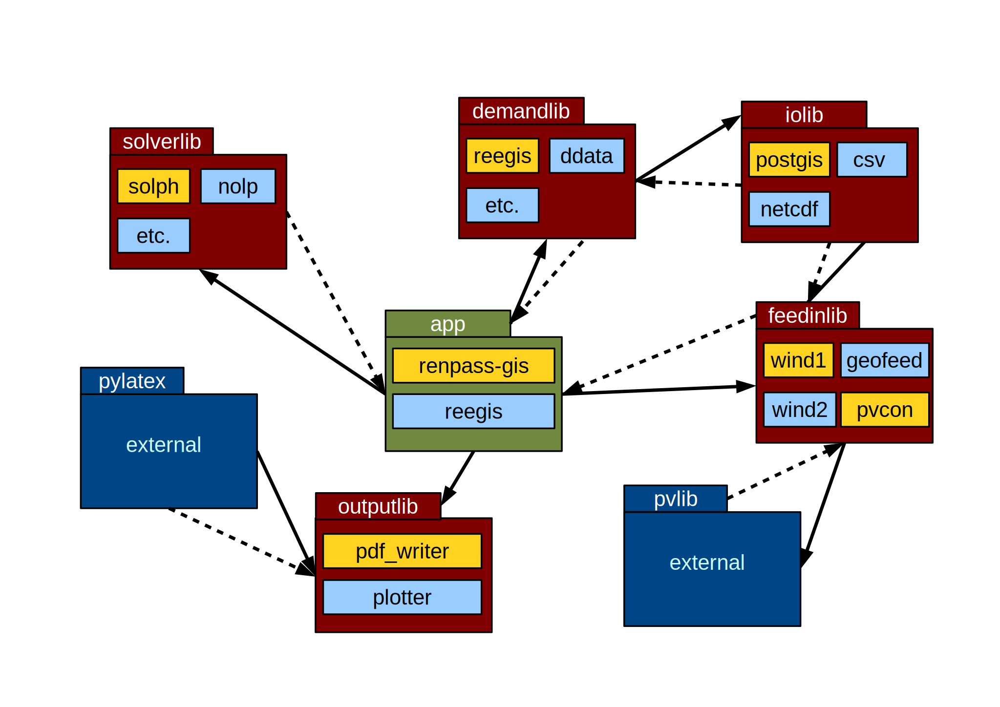

##########################################
 About oemof
##########################################

This overview was developed to make oemof easy to use and develop. It describes general ideas and structures of oemof and its modules.

The idea of an open framework
==============================

The Open Energy System Modeling Framework has been developed for the modeling and analysis of energy supply systems considering power and heat as well as prospectively mobility.

oemof is programmed in Python and uses several Python packages for scientific applications (e.g. mathematical optimisation, network analysis, data analyses), optionally in combination with a PostgreSQL/PostGIS Database. It offers a toolbox of various functionalities needed to build energy system models in high temporal and spatial resolution. For instance, the wind energy feed-in in a model region based on weather data can be modelled, the CO2-minimal operation of biomass power plants can be calculated or the future energy supply of Europe can be simulated.

The framework consists of different packages. For the communication between these packages interfaces are provided. 
The oemof packages and their modules are used to build what we call 'application' and depicts
a concrete energy system model (or a subprocess of this model). The following image 
illustrates this idea:

Besides other applications the apps "renpass-gis" and "reegis" are currently developed based on the framework. 
"renpass-gis" enables the simulation of a future European energy system with a high spatial and temporal resolution. 
Different expansion pathways of conventional power plants, renewable energies and net infrastructure can be considered. The app "reegis" provides a simulation of a regional heat and power supply system. 
These two examples show that the modular approach of the framework allows 
applications with very different objectives. 

Underlying oemof concept 
==============================

The modeling of energy supply systems and its variety of components has a cleary structured approach within the oemof framework. Thus, energy supply systems with different levels of complexity can be based on equal basic module blocks. Those form an universal basic structure.

An *node* is either a *bus* or a *component*. A bus is always connected with one or several components and characterised by an unique identifier (electricity, gas, heat). Components take resources from or feed resources to buses. Transfers from buses are inputs of components, transfers to buses are ouputs of components.

Components are likewise always connected with one or several buses. Based on their characteristics they are divided into several sub types. *Transformers* have input and output, e.g. a gas turbine takes from a bus of type 'gas' and feeds into a bus of type 'electricity'. With additional information like parameters and transfer functions input and output can be specified. Using the example of a gas turbine the resource consumption (input) is related to the provided end energy (output) by means of an efficiency factor. A *sink* has only an input but no output. With *sink* consumers like households can be modeled. A *source* has exactly one output but no input. Thus for example, wind energy and photovoltaic plants can be modeled. Components of type *transport* have like transformers input and output. However, corresponding buses are always of the same type, e.g. electricity. With components of type transport transmission lines can be modeled for example.

Components and buses can be combined to an energy system. Buses are nodes, connected among each other through edges which are the inputs and outputs of the components. Such a model can be interpreted mathematically as bipartite graph as buses are solely connected to components and vice versa. Thereby the in- and outputs of the components are the directed edges of the graph. The buses themselves are the nodes of the graph.

Besides the use of the basic components one has the possibility to develop more specified components on the base of the basic components. The following figure illustrates the setup of a simple energy system and the basic structure explained before.

Example
------------------

An example of a simple energy system shows the usage of the nodes for 
real world representations.

*Region1:*

components: wind turbine (wt1), electrical demand (dm1), gas turbine (gt1), cable to region2 (cb1)
buses: gas pipeline (r1_gas), electrical grid (r1_el)

*Region2:*

components: coal plant (cp2), chp plant (chp2), electrical demand (dm2), cable to region2 (cb2), p2g-facility (ptg2)
buses: electrical grid (r2_el), local heat network (r2_th), coal reservoir (r2_coal), gas pipeline (r2_gas)

In oemof this would look as follows::

                input/output  r1_gas   r1_el   r2_el   r2_th   r2_coal   r2_gas
                     |          |        |       |       |       |         |
                     |          |        |       |       |       |         |
      wt1(Source)    |------------------>|       |       |       |         |
                     |          |        |       |       |       |         |
                     |          |        |       |       |       |         |
        dm1(Sink)    |<------------------|       |       |       |         |
                     |          |        |       |       |       |         |
                     |          |        |       |       |       |         |
 gt1(Transformer)    |<---------|        |       |       |       |         |
                     |------------------>|       |       |       |         |
                     |          |        |       |       |       |         |
                     |          |        |       |       |       |         |
   cb1(Transport)    |          |        |------>|       |       |         |
                     |          |        |       |       |       |         |
                     |          |        |       |       |       |         |
 cp2(Transformer)    |<------------------------------------------|         |
                     |-------------------------->|       |       |         |
                     |          |        |       |       |       |         |
                     |          |        |       |       |       |         |
 chp2(Transformer)   |<----------------------------------------------------|
                     |-------------------------->|       |       |         |
                     |---------------------------------->|       |         |
                     |          |        |       |       |       |         |
                     |          |        |       |       |       |         |
        dm2(Sink)    |<--------------------------|       |       |         |
                     |          |        |       |       |       |         |
                     |          |        |       |       |       |         |
   cb2(Transport)    |          |        |<------|       |       |         |
                     |          |        |       |       |       |         |
                     |          |        |       |       |       |         |
 ptg2(Transformer)   |<--------------------------|       |       |         |
                     |---------------------------------------------------->|

Why are we developing oemof? 
==============================
Energy system models often do not have publicly accessible source code and freely available data and are poorly documented. The missing transparency slows down the scientific discussion on  model quality with regard to certain problems such as grid extension. Besides, energy system models are often developed for a certain application and cannot be adjusted (or only with great effort) to other requirements.

The Center for Sustainable Energy Systems (ZNES) together with the Reiner Lemoine Institute (RLI) in Berlin and the Otto-von-Guericke-University of Magdeburg (OVGU) are developing an Open Energy System Modelling Framework (oemof) that addresses these problems by offering a free, open and clearly documented framework for energy system modelling. This transparent approach allows a sound scientific discourse on the underlying models and data. In this way the assessment of quality and significance of undertaken analyses is improved. Moreover, the modular composition of the framework supports the adjustment to a large number of application purposes. The open source approach allows a collaborative development of the framework that offers several advantages:

- **Synergies** - By developing collaboratively synergies between the participating institutes can be utilized.

- **Debugging** - Through the input of a larger group of users and developers bugs are identified and fixed at an earlier stage.

- **Advancement** - The oemof-based application profits from further development of the framework.

Documentation
===============

The framework is documented on three different levels: (1) code commenting,
(2) code documentation and, (3) a general documentation.

Code commenting
------------------------

Code comments are block and inline comments in the source code. They can help to understand the code and should be utilized "as much as necessary, as little as possible". When writing comments follow the PEP 0008 style guide: https://www.python.org/dev/peps/pep-0008/#comments.

Code documentation
------------------------

Code documentation is done via documentation strings, a.k.a. "docstrings", 
and used for all public modules, functions, classes, and methods. 

We are using the numpydoc extension of sphinx and thus the numpydoc 
docstring notation. PEP 0257 (https://www.python.org/dev/peps/pep-0257/) lays 
down a few, very general conventions for docstrings. 

General documentation
------------------------

The general implementation-independent documentation such as installation guide, flow charts, and mathematical models is done via ReStructuredText (rst). The files can be found in the folder */oemof/doc*.
For further information on restructured text see: http://docutils.sourceforge.net/rst.html.

More information on the functionality of the respective classes can be found in their `ApiDocs [Link!] <http://www.python.org>`_.

