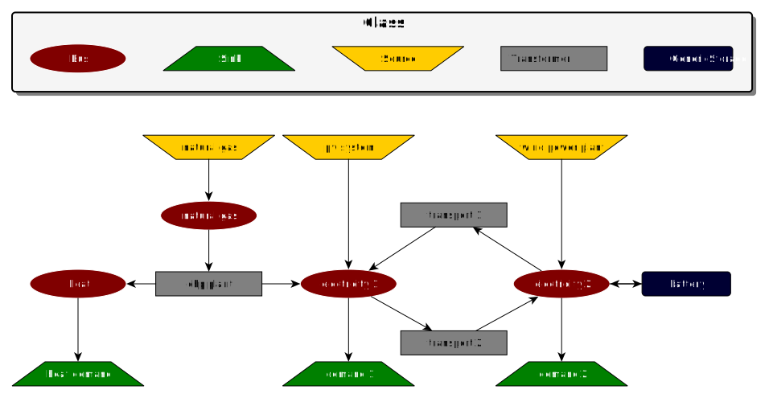
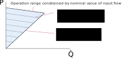

.. _oemof_solph_label:

~~~~~~~~~~~
oemof-solph
~~~~~~~~~~~

Solph is an oemof-package, designed to create and solve linear or mixed-integer linear optimization problems. The packages is based on pyomo. To create an energy system model the :ref:`oemof_network_label` is used and extended by components such as storages. To get started with solph, checkout the examples in the :ref:`solph_examples_label` section.

.. contents::
    :depth: 2
    :local:
    :backlinks: top

How can I use solph?
--------------------

To use solph you have to install oemof and at least one solver, which can be used together with pyomo. See `pyomo installation guide <https://software.sandia.gov/downloads/pub/pyomo/PyomoInstallGuide.html#Solvers>`_.
You can test it by executing one of the existing examples. Be aware that the examples require the CBC solver but you can change the solver name in the example files to your solver.

Once the example work you are close to your first energy model.

Set up an energy system
^^^^^^^^^^^^^^^^^^^^^^^

In most cases an EnergySystem object is defined when we start to build up an energy system model. The EnergySystem object will be the main container for the model.

To define an EnergySystem we need a Datetime index to define the time range and increment of our model. An easy way to this is to use the pandas time_range function.
The following code example defines the year 2011 in hourly steps. See `pandas date_range guide <http://pandas.pydata.org/pandas-docs/stable/generated/pandas.date_range.html>`_ for more information.

.. code-block:: python

    import pandas as pd
    my_index = pd.date_range('1/1/2011', periods=8760, freq='H')

This index can be used to define the EnergySystem:

.. code-block:: python

    import oemof.solph as solph
    my_energysystem = solph.EnergySystem(timeindex=my_index)

Now you can start to add the components of the network.

Add components to the energy system
^^^^^^^^^^^^^^^^^^^^^^^^^^^^^^^^^^^^^^^^

After defining an instance of the EnergySystem class you have to add all nodes you define in the following to your EnergySystem.

Basically, there are two types of *nodes* - *components* and *buses*. Every Component has to be connected with one or more *buses*. The connection between a *component* and a *bus* is the *flow*.

All solph *components* can be used to set up an energy system model but you should read the documentation of each *component* to learn about usage and restrictions. For example it is not possible to combine every *component* with every *flow*. Furthermore, you can add your own *components* in your application (see below) but we would be pleased to integrate them into solph if they are of general interest. To do so please use the module oemof.solph.custom as described here: http://oemof.readthedocs.io/en/latest/developing_oemof.html#contribute-to-new-components

An example of a simple energy system shows the usage of the nodes for 
real world representations:

The figure shows a simple energy system using the four basic network classes and the Bus class.
If you remove the transmission line (transport 1 and transport 2) you get two systems but they are still one energy system in terms of solph and will be optimised at once.

There are different ways to add components to an *energy system*. The following line adds a *bus* object to the *energy system* defined above.

.. code-block:: python

    my_energysystem.add(solph.Bus())

It is also possible to assign the bus to a variable and add it afterwards. In that case it is easy to add as many objects as you like.

.. code-block:: python

    my_bus1 = solph.Bus()
    my_bus2 = solph.Bus()
    my_energysystem.add(bgas, bel)

Therefore it is also possible to add lists or dictionaries with components but you have to dissolve them.

.. code-block:: python

    # add a list
    my_energysystem.add(*my_list)

    # add a dictionary
    my_energysystem.add(*my_dictionary.values())

Bus
+++

All flows into and out of a *bus* are balanced. Therefore an instance of the Bus class represents a grid or network without losses. To define an instance of a Bus only a unique label is necessary. If you do not set a label a random label is used but this makes it difficult to get the results later on.

To make it easier to connect the bus to a component you can optionally assign a variable for later use.

.. code-block:: python

    solph.Bus(label='natural_gas')
    electricity_bus = solph.Bus(label='electricity')

.. note:: See the :py:class:`~oemof.solph.network.Bus` class for all parameters and the mathematical background.

Flow
++++

The flow class has to be used to connect. An instance of the Flow class is normally used in combination with the definition of a component.
A Flow can be limited by upper and lower bounds (constant or time-dependent) or by summarised limits.
For all parameters see the API documentation of the :py:class:`~oemof.solph.network.Flow` class or the examples of the nodes below. A basic flow can be defined without any parameter.

.. code-block:: python

    solph.Flow()

Oemof has different types of *flows* but you should be aware that you cannot connect every *flow* type with every *component*.

.. note:: See the :py:class:`~oemof.solph.network.Flow` class for all parameters and the mathematical background.

Components
++++++++++

Components are divided in three categories. Basic components (solph.network), additional components (solph.components) and custom components (solph.custom). The custom section was created to lower the entry barrier for new components. Be aware that these components are in an experimental state. Let us know if you have used and tested these components. This is the first step to move them to the components section.

See :ref:`oemof_solph_components_label` for a list of all components.

.. _oemof_solph_optimise_es_label:

Optimise your energy system
^^^^^^^^^^^^^^^^^^^^^^^^^^^

The typical optimisation of an energy system in solph is the dispatch optimisation, which means that the use of the sources is optimised to satisfy the demand at least costs.
Therefore, variable cost can be defined for all components. The cost for gas should be defined in the gas source while the variable costs of the gas power plant are caused by operating material.
You can deviate from this scheme but you should keep it consistent to make it understandable for others.

Costs do not have to be monetary costs but could be emissions or other variable units.

Furthermore, it is possible to optimise the capacity of different components (see :ref:`investment_mode_label`).

.. code-block:: python

    # set up a simple least cost optimisation
    om = solph.Model(my_energysystem)

    # solve the energy model using the CBC solver
    om.solve(solver='cbc', solve_kwargs={'tee': True})

If you want to analyse the lp-file to see all equations and bounds you can write the file to you disc. In that case you should reduce the timesteps to 3. This will increase the readability of the file.

.. code-block:: python

    # set up a simple least cost optimisation
    om = solph.Model(my_energysystem)

    # write the lp file for debugging or other reasons
    om.write('path/my_model.lp', io_options={'symbolic_solver_labels': True})

Analysing your results
^^^^^^^^^^^^^^^^^^^^^^

If you want to analyse your results, you should first dump your EnergySystem instance, otherwise you have to run the simulation again.

.. code-block:: python

    my_energysystem.results = processing.results(om)
    my_energysystem.dump('my_path', 'my_dump.oemof')

If you need the meta results of the solver you can do the following:

.. code-block:: python

    my_energysystem.results['main'] = processing.results(om)
    my_energysystem.results['meta'] = processing.meta_results(om)
    my_energysystem.dump('my_path', 'my_dump.oemof')

To restore the dump you can simply create an EnergySystem instance and restore your dump into it.

.. code-block:: python

    import oemof.solph as solph
    my_energysystem = solph.EnergySystem()
    my_energysystem.restore('my_path', 'my_dump.oemof')
    results = my_energysystem.results

    # If you use meta results do the following instead of the previous line.
    results = my_energysystem.results['main']
    meta = my_energysystem.results['meta']

If you call dump/restore without any parameters, the dump will be stored as *'es_dump.oemof'* into the *'.oemof/dumps/'* folder created in your HOME directory.

See :ref:`oemof_outputlib_label` to learn how to process, plot and analyse the results.

.. _oemof_solph_components_label:

Solph components
----------------

 * :ref:`oemof_solph_components_sink_label`
 * :ref:`oemof_solph_components_source_label`
 * :ref:`oemof_solph_components_transformer_label`
 * :ref:`oemof_solph_components_extraction_turbine_chp_label`
 * :ref:`oemof_solph_components_generic_caes_label`
 * :ref:`oemof_solph_components_generic_chp_label`
 * :ref:`oemof_solph_components_generic_storage_label`
 * :ref:`oemof_solph_custom_electrical_line_label`
 * :ref:`oemof_solph_custom_link_label`

.. _oemof_solph_components_sink_label:

Sink (basic)
^^^^^^^^^^^^

A sink is normally used to define the demand within an energy model but it can also be used to detect excesses.

The example shows the electricity demand of the electricity_bus defined above.
The *'my_demand_series'* should be sequence of normalised values while the *'nominal_value'* is the maximum demand the normalised sequence is multiplied with.
The parameter *'fixed=True'* means that the actual_value can not be changed by the solver.

.. code-block:: python

    solph.Sink(label='electricity_demand', inputs={electricity_bus: solph.Flow(
        actual_value=my_demand_series, fixed=True, nominal_value=nominal_demand)})

In contrast to the demand sink the excess sink has normally less restrictions but is open to take the whole excess.

.. code-block:: python

    solph.Sink(label='electricity_excess', inputs={electricity_bus: solph.Flow()})

.. note:: The Sink class is only a plug and provides no additional constraints or variables.

.. _oemof_solph_components_source_label:

Source (basic)
^^^^^^^^^^^^^^

A source can represent a pv-system, a wind power plant, an import of natural gas or a slack variable to avoid creating an in-feasible model.

While a wind power plant will have an hourly feed-in depending on the weather conditions the natural_gas import might be restricted by maximum value (*nominal_value*) and an annual limit (*summed_max*).
As we do have to pay for imported gas we should set variable costs.
Comparable to the demand series an *actual_value* in combination with *'fixed=True'* is used to define the normalised output of a wind power plan. The *nominal_value* sets the installed capacity.

.. code-block:: python

    solph.Source(
        label='import_natural_gas',
        outputs={my_energysystem.groups['natural_gas']: solph.Flow(
            nominal_value=1000, summed_max=1000000, variable_costs=50)})

    solph.Source(label='wind', outputs={electricity_bus: solph.Flow(
        actual_value=wind_power_feedin_series, nominal_value=1000000, fixed=True)})

.. note:: The Source class is only a plug and provides no additional constraints or variables.

.. _oemof_solph_components_transformer_label:

Transformer (basic)
^^^^^^^^^^^^^^^^^^^

An instance of the Transformer class can represent a node with multiple input and output flows such as a power plant, a transport line or any kind of a transforming process as electrolysis, a cooling device or a heat pump.
The efficiency has to be constant within one time step to get a linear transformation.
You can define a different efficiency for every time step (e.g. the thermal powerplant efficiency according to the ambient temperature) but this series has to be predefined and cannot be changed within the optimisation.

A condensing power plant can be defined by a transformer with one input (fuel) and one output (electricity).

.. code-block:: python

    b_gas = solph.Bus(label='natural_gas')
    b_el = solph.Bus(label='electricity')

    solph.Transformer(
        label="pp_gas",
        inputs={bgas: solph.Flow()},
        outputs={b_el: solph.Flow(nominal_value=10e10)},
        conversion_factors={electricity_bus: 0.58})

A CHP power plant would be defined in the same manner but with two outputs:

.. code-block:: python

    b_gas = solph.Bus(label='natural_gas')
    b_el = solph.Bus(label='electricity')
    b_th = solph.Bus(label='heat')

    solph.Transformer(
        label='pp_chp',
        inputs={b_gas: Flow()},
        outputs={b_el: Flow(nominal_value=30),
                 b_th: Flow(nominal_value=40)},
        conversion_factors={b_el: 0.3, b_th: 0.4})

A CHP power plant with 70% coal and 30% natural gas can be defined with two inputs and two outputs:

.. code-block:: python

    b_gas = solph.Bus(label='natural_gas')
    b_coal = solph.Bus(label='hard_coal')
    b_el = solph.Bus(label='electricity')
    b_th = solph.Bus(label='heat')

    solph.Transformer(
        label='pp_chp',
        inputs={b_gas: Flow(), b_coal: Flow()},
        outputs={b_el: Flow(nominal_value=30),
                 b_th: Flow(nominal_value=40)},
        conversion_factors={b_el: 0.3, b_th: 0.4,
                            b_coal: 0.7, b_gas: 0.3})

A heat pump would be defined in the same manner. New buses are defined to make the code cleaner:

.. code-block:: python

    b_el = solph.Bus(label='electricity')
    b_th_low = solph.Bus(label='low_temp_heat')
    b_th_high = solph.Bus(label='high_temp_heat')

    # The cop (coefficient of performance) of the heat pump can be defined as
    # a scalar or a sequence.
    cop = 3

    solph.Transformer(
        label='heat_pump',
        inputs={b_el: Flow(), b_th_low: Flow()},
        outputs={b_th_high: Flow()},
        conversion_factors={b_el: 1/cop,
                            b_th_low: (cop-1)/cop})

If the low-temperature reservoir is nearly infinite (ambient air heat pump) the low temperature bus is not needed and, therefore, a Transformer with one input is sufficient.

.. note:: See the :py:class:`~oemof.solph.network.Transformer` class for all parameters and the mathematical background.

.. _oemof_solph_components_extraction_turbine_chp_label:

ExtractionTurbineCHP (component)
^^^^^^^^^^^^^^^^^^^^^^^^^^^^^^^^

The :py:class:`~oemof.solph.components.ExtractionTurbineCHP` inherits from the
:ref:`oemof_solph_components_transformer_label` class. Like the name indicates,
the application example for the component is a flexible combined heat and power
(chp) plant. Of course, an instance of this class can represent also another
component with one input and two output flows and a flexible ratio between
these flows, leading to the following constraints:

.. include:: ../oemof/solph/components.py
  :start-after: _ETCHP-equations:
  :end-before: """

These constraints are applied in addition those of a standard
:class:`~oemof.solph.network.Transformer`. The constraints limit the range of
the possible operation points, like the following picture shows. For a certain
flow of fuel, there is a line of operation points, whose slope is defined by
:math:`\beta`. The second constrain limits the decrease of electrical power.

   
For now :py:class:`~oemof.solph.components.ExtractionTurbineCHP` instances are
restricted to one input and two output flows. The class allows the definition
of a different efficiency for every time step but the corresponding series has
to be predefined as a parameter for the optimisation. In contrast to the
:class:`~oemof.solph.network.Transformer`, a main flow and a tapped flow is
defined. For the main flow you can define a conversion factor if the second
flow is zero (conversion_factor_single_flow).

.. code-block:: python

    solph.ExtractionTurbineCHP(
        label='variable_chp_gas',
        inputs={b_gas: solph.Flow(nominal_value=10e10)},
        outputs={b_el: solph.Flow(), b_th: solph.Flow()},
        conversion_factors={b_el: 0.3, b_th: 0.5},
        conversion_factor_single_flow={b_el: 0.5})

The key of the parameter *'conversion_factor_single_flow'* will indicate the
main flow. In the example above, the flow to the Bus *'b_el'* is the main flow
and the flow to the Bus *'b_th'* is the tapped flow. The following plot shows
how the variable chp (right) schedules it's electrical and thermal power
production in contrast to a fixed chp (left). The plot is the output of an
example in the `oemof example repository
<https://github.com/oemof/oemof_examples>`_.

.. 	image:: _files/variable_chp_plot.svg
   :scale: 10 %
   :alt: variable_chp_plot.svg
   :align: center

.. note:: See the :py:class:`~oemof.solph.components.ExtractionTurbineCHP` class for all parameters and the mathematical background.

.. _oemof_solph_components_generic_caes_label:

GenericCAES (component)
^^^^^^^^^^^^^^^^^^^^^^^^^^

Compressed Air Energy Storage (CAES).

.. note:: See the :py:class:`~oemof.solph.components.GenericCAES` class for all parameters and the mathematical background.

.. _oemof_solph_components_generic_chp_label:

GenericCHP (component)
^^^^^^^^^^^^^^^^^^^^^^^^^^

With the GenericCHP class combined heat and power plants can be modelled with more details.

.. note:: See the :py:class:`~oemof.solph.components.GenericCHP` class for all parameters and the mathematical background.

.. _oemof_solph_components_generic_storage_label:

GenericStorage (component)
^^^^^^^^^^^^^^^^^^^^^^^^^^

In contrast to the three classes above the storage class is a pure solph class and is not inherited from the oemof-network module.
The *nominal_capacity* of the storage signifies the storage capacity. You can either set it to the net capacity or to the gross capacity and limit it using the min/max attribute.
To limit the input and output flows, you can define the *nominal_value* in the Flow objects.
Furthermore, an efficiency for loading, unloading and a capacity loss per time increment can be defined. For more information see the definition of the  :py:class:`~oemof.solph.components.GenericStorage` class.

.. code-block:: python

    solph.GenericStorage(
        label='storage',
        inputs={b_el: solph.Flow(nominal_value=9, variable_costs=10)},
        outputs={b_el: solph.Flow(nominal_value=25, variable_costs=10)},
        capacity_loss=0.001, nominal_capacity=50,
        inflow_conversion_factor=0.98, outflow_conversion_factor=0.8)

Using an investment object with the GenericStorage component
+++++++++++++++++++++++++++++++++++++++++++++++++++++++++++++

Based on the `GenericStorage` object the `GenericInvestmentStorageBlock` adds two main investment possibilities.

    *	Invest into the flow parameters e.g. a turbine or a pump
    *	Invest into capacity of the storage  e.g. a basin or a battery cell
    
Investment in this context refers to the value of the variable for the 'nominal_value' (installed capacity) in the investment mode. 
    
As an addition to other flow-investments, the storage class implements the possibility to couple or decouple the flows 
with the capacity of the storage. 
Three parameters are responsible for connecting the flows and the capacity of the storage:

    *	' `invest_relation_input_capacity` ' fixes the input flow investment to the capacity investment. A ratio of ‘1’ means that the storage can be filled within one time-period.
    *	' `invest_relation_output_capacity` ' fixes the output flow investment to the capacity investment. A ratio of ‘1’ means that the storage can be emptied within one period.
    *	' `invest_relation_input_output` ' fixes the input flow investment to the output flow investment. For values <1, the input will be smaller and for values >1 the input flow will be larger. 
    
You should not set all 3 parameters at the same time, since it will lead to overdetermination.

The following example pictures a Pumped Hydroelectric Energy Storage (PHES). Both flows and the storage itself (representing: pump, turbine, basin) are free in their investment. You can set the parameters to `None` or delete them as `None` is the default value.

.. code-block:: python

    solph.GenericStorage(
        label='PHES',
        inputs={b_el: solph.Flow(investment= solph.Investment(ep_costs=500))},
        outputs={b_el: solph.Flow(investment= solph.Investment(ep_costs=500)},
        capacity_loss=0.001, 
        inflow_conversion_factor=0.98, outflow_conversion_factor=0.8),
        investment = solph.Investment(ep_costs=40))

The following example describes a battery with flows coupled to the capacity of the storage.

.. code-block:: python

    solph.GenericStorage(
        label='battery',
        inputs={b_el: solph.Flow()},
        outputs={b_el: solph.Flow()},
        capacity_loss=0.001, 
        nominal_capacity=50,
        inflow_conversion_factor=0.98,
         outflow_conversion_factor=0.8,
        invest_relation_input_capacity = 1/6,
        invest_relation_output_capacity = 1/6,
        investment = solph.Investment(ep_costs=400))

.. note:: See the :py:class:`~oemof.solph.components.GenericStorage` class for all parameters and the mathematical background.

.. _oemof_solph_custom_electrical_line_label:

ElectricalLine (custom)
^^^^^^^^^^^^^^^^^^^^^^^

Electrical line.

.. note:: See the :py:class:`~oemof.solph.custom.ElectricalLine` class for all parameters and the mathematical background.

.. _oemof_solph_custom_link_label:

Link (custom)
^^^^^^^^^^^^^

Link.

.. note:: See the :py:class:`~oemof.solph.custom.Link` class for all parameters and the mathematical background.

.. _investment_mode_label:

Using the investment mode
-------------------------

As described in :ref:`oemof_solph_optimise_es_label` the typical way to optimise an energy system is the dispatch optimisation based on marginal costs. Solph also provides a combined dispatch and investment optimisation.
Based on investment costs you can compare the usage of existing components against building up new capacity.
The annual savings by building up new capacity must therefore compensate the annuity of the investment costs (the time period does not have to be one year but depends on your Datetime index).

See the API of the :py:class:`~oemof.solph.options.Investment` class to see all possible parameters.

Basically an instance of the investment class can be added to a Flow or a
Storage. All parameters that usually refer to the *nominal_value/capacity* will
now refer to the investment variables and existing capacity. It is also
possible to set a maximum limit for the capacity that can be build.
If existing capacity is considered for a component with investment mode enabled,
the *ep_costs* still apply only to the newly built capacity.

The investment object can be used in Flows and some components. See the
:ref:`oemof_solph_components_label` section for detailed information of each
component.

For example if you want to find out what would be the optimal capacity of a wind
power plant to decrease the costs of an existing energy system, you can define
this model and add an investment source.
The *wind_power_time_series* has to be a normalised feed-in time series of you
wind power plant. The maximum value might be caused by limited space for wind
turbines.

.. code-block:: python

    solph.Source(label='new_wind_pp', outputs={electricity: solph.Flow(
        actual_value=wind_power_time_series, fixed=True,
	investment=solph.Investment(ep_costs=epc, maximum=50000))})

Let's slightly alter the case and consider for already existing wind power
capacity of 20,000 kW. We're still expecting the total wind power capacity, thus we
allow for 30,000 kW of new installations and formulate as follows.

.. code-block:: python

    solph.Source(label='new_wind_pp', outputs={electricity: solph.Flow(
        actual_value=wind_power_time_series, fixed=True,
	    investment=solph.Investment(ep_costs=epc,
	                                maximum=30000,
	                                existing=20000))})

The periodical costs (*ep_costs*) are typically calculated as follows:

.. code-block:: python

    capex = 1000  # investment cost
    lifetime = 20  # life expectancy
    wacc = 0.05  # weighted average of capital cost
    epc = capex * (wacc * (1 + wacc) ** lifetime) / ((1 + wacc) ** lifetime - 1)

This also implemented in :func:`~.oemof.tools.economics.annuity`. The code above
would look like this:

.. code-block:: python

    from oemof.tools import economics
    epc = economics.annuity(1000, 20, 0.05)

.. note:: At the moment the investment class is not compatible with the MIP classes :py:class:`~oemof.solph.options.NonConvex`.

Mixed Integer (Linear) Problems
-------------------------------

Solph also allows you to model components with respect to more technical details
such as a minimal power production. Therefore, the class 
:py:class:`~oemof.solph.options.NonConvex` exists in the 
:py:mod:`~oemof.solph.options` module.
Note that the usage of this class is currently not compatible with the
:py:class:`~oemof.solph.options.Investment` class.

If you want to use the functionality of the options-module, the only thing
you have to do is to invoke a class instance inside your Flow() - declaration:

.. code-block:: python

    b_gas = solph.Bus(label='natural_gas')
    b_el = solph.Bus(label='electricity')
    b_th = solph.Bus(label='heat')

    solph.Transformer(
        label='pp_chp',
        inputs={b_gas: Flow()},
        outputs={b_el: Flow(nominal_value=30,
                            nonconvex=NonConvex()),
                 b_th: Flow(nominal_value=40)},
        conversion_factors={b_el: 0.3, b_th: 0.4})

The NonConvex() object of the electrical output of the created LinearTransformer will create 
a 'status' variable for the flow.
This will be used to model for example minimal/maximal power production constraints if the
attributes `min`/`max` of the flow are set. It will also be used to include start up constraints and costs
if corresponding attributes of the class are provided. For more
information see the API of the :py:class:`~oemof.solph.options.NonConvex` class and its corresponding 
block class :py:class:`~oemof.solph.blocks.NonConvex`.

.. note:: The usage of this class can sometimes be tricky as there are many interdenpendencies. So
          check out the examples and do not hesitate to ask the developers if your model does
          not work as expected.

Adding additional constraints
-----------------------------

You can add additional constraints to your :py:class:`~oemof.solph.models.Model`. See `flexible_modelling in the example repository
<https://github.com/oemof/oemof_examples/blob/master/examples/oemof_0.2/flexible_modelling/add_constraints.py>`_ to learn how to do it.

Some predefined additional constraints can be found in the
:py:mod:`~oemof.solph.constraints` module.

 * Emission limit for the model -> :func:`~.oemof.solph.constraints.emission_limit`
 * Coupling of two variables e.g. investment variables) with a factor ->
   :func:`~.oemof.solph.constraints.equate_variables`
 * Overall investment limit -> :func:`~.oemof.solph.constraints.investment_limit`

The Grouping module (Sets)
-----------------------------------------------------
To construct constraints,
variables and objective expressions inside the :py:mod:`~oemof.solph.blocks`
and the :py:mod:`~oemof.solph.models` modules, so called groups are used. Consequently,
certain constraints are created for all elements of a specific group. Thus,
mathematically the groups depict sets of elements inside the model.

The grouping is handled by the solph grouping module :py:mod:`~oemof.solph.groupings`
which is based on the oemof core :py:mod:`~oemof.groupings` functionality. You
do not need to understand how the underlying functionality works. Instead, checkout
how the solph grouping module is used to create groups.

The simplest form is a function that looks at every node of the energy system and
returns a key for the group depending e.g. on node attributes:

.. code-block:: python

    def constraint_grouping(node):
        if isinstance(node, Bus) and node.balanced:
            return blocks.Bus
        if isinstance(node, Transformer):
            return blocks.Transformer
   GROUPINGS = [constraint_grouping]

This function can be passed in a list to :attr:`groupings` of
:class:`oemof.solph.network.EnergySystem`. So that we end up with two groups,
one with all Transformers and one with all Buses that are balanced. These
groups are simply stored in a dictionary. There are some advanced functionalities
to group two connected nodes with their connecting flow and others
(see for example: :py:class:`~oemof.groupings.FlowsWithNodes`).

Using the Excel (csv) reader
----------------------------

Alternatively to a manual creation of energy system component objects as describe above, can also be created from a excel sheet (libreoffice, gnumeric...).

The idea is to create different sheets within one spreadsheet file for different components. Afterwards you can loop over the rows with the attributes in the columns. The name of the columns may differ from the name of the attribute. You may even create two sheets for the GenericStorage class with attributes such as C-rate for batteries or capacity of turbine for a PHES.

Once you have create your specific excel reader you can lower the entry barrier for other users. It is some sort of a GUI in form of platform independent spreadsheet software and to make data and models exchangeable in one archive.

See the `example repository <https://github.com/oemof/oemof_examples>`_ for an excel reader example.

.. _solph_examples_label:

Solph Examples
--------------

See the `example repository <https://github.com/oemof/oemof_examples>`_ for various examples. The repository has sections for each major release.
