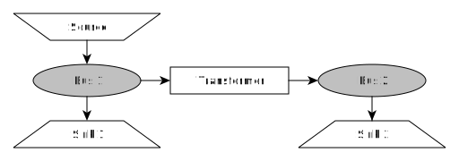

.. _using_oemof_label:

Use solph
=========
The :ref:`oemof_solph_label` library is part of the oemof installation. Solph is designed to create and solve linear or mixed-integer
linear optimization problems. It is based on optimization modelling language pyomo.

To use solph at least one linear solver has to be installed on your system. See the `pyomo installation guide <https://pyomo.readthedocs.io/en/stable/solving_pyomo_models.html#supported-solvers>`_ to learn which solvers are supported. Solph is tested with the open source solver `cbc` and the `gurobi` solver (free for academic use). The open `glpk` solver recently showed some odd behaviour.

The formulation of the energy system is based on the oemof-network library but contains additional components such as storages. Furthermore the network class are enhanced with additional parameters such as efficiencies, bounds, cost and more. See the API documentation for more details. Try the `examples <https://github.com/oemof/oemof-examples>`_ to learn how to build a linear energy system.

Create a generic energy system
==============================
The :ref:`oemof_network_label` library is part of the oemof installation. By now it can be used to define energy systems as a network with components and buses. Every component should be connected to one or more buses. After definition, a component has to explicitely be added to its energy system. Allowed components are sources, sinks and transformer.

The code of the example above:

.. code-block:: python

    from oemof.solph import network
    from oemof.solph import energy_system

    # create the energy system
    es = energy_system.EnergySystem()

    # create bus 1
    bus_1 = network.Bus(label="bus_1")

    # create bus 2
    bus_2 = network.Bus(label="bus_2")

    # add bus 1 and bus 2 to energy system
    es.add(bus_1, bus_2)

    # create and add sink 1 to energy system
    es.add(network.Sink(label='sink_1', inputs={bus_1: []}))

    # create and add sink 2 to energy system
    es.add(network.Sink(label='sink_2', inputs={bus_2: []}))

    # create and add source to energy system
    es.add(network.Source(label='source', outputs={bus_1: []}))

    # create and add transformer to energy system
    es.add(network.Transformer(label='transformer', inputs={bus_1: []}, outputs={bus_2: []}))

The network class is aimed to be very generic, see the component or custom (experimental!) module
for more specific components.

Process Results
===============

.. code-block:: python

    results = outputlib.processing.results(om)
    heat = outputlib.views.node(results, 'heat')

To visualize results, either use `pandas own visualization functionality <http://pandas.pydata.org/pandas-docs/version/0.18.1/visualization.html>`_, matplotlib or the plot library of your
choice. Some existing plot methods can be found in a separate repository
`oemof_visio <https://github.com/oemof/oemof_visio>`_
which can be helpful when looking for a quick way to create a plot.
