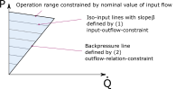

.. _oemof_solph_label:

.. _using_oemof_label:

~~~~~~~~~~~~
User's guide
~~~~~~~~~~~~

Solph is an oemof-package, designed to create and solve linear or mixed-integer linear optimization problems. The package is based on pyomo. To create an energy system model generic and specific components are available. To get started with solph, checkout the examples in the :ref:`examples_label` section.

This User's guide provides a user-friendly introduction into oemof-solph,
which includes small examples and nice illustrations.
However, the functionalities of oemof-solph go beyond the content of this User's guide section.
So, if you want to know all details of a certain component or a function,
please go the :ref:`api_reference_label`. There, you will find
a detailed and complete description of all oemof-solph modules.

.. contents::
    :depth: 2
    :local:
    :backlinks: top

How can I use solph?
--------------------

To use solph you have to install oemof.solph and at least one solver (see :ref:`installation_label`), which can be used together with pyomo (e.g. CBC, GLPK, Gurobi, Cplex). See the `pyomo installation guide <https://pyomo.readthedocs.io/en/stable/solving_pyomo_models.html#supported-solvers>`_ for all supported solvers.
You can test it by executing one of the existing examples (see :ref:`examples_label`).
Be aware that the examples require the CBC solver but you can change the solver name in the example files to your
solver.

Once the examples work you are close to your first energy model.

Handling of Warnings
^^^^^^^^^^^^^^^^^^^^

The solph library is designed to be as generic as possible to make it possible
to use it in different use cases. This concept makes it difficult to raise
Errors or Warnings because sometimes untypical combinations of parameters are
allowed even though they might be wrong in over 99% of the use cases.

Therefore, a SuspiciousUsageWarning was introduced. This warning will warn you
if you do something untypical. If you are sure that you know what you are doing
you can switch the warning off.

See `the debugging module of oemof-tools <https://oemof-tools.readthedocs.io/en/latest/usage.html#debugging>`_ for more
information.

Set up an energy system
^^^^^^^^^^^^^^^^^^^^^^^

In most cases an EnergySystem object is defined when we start to build up an energy system model. The EnergySystem object will be the main container for the model's elements.

The model time is defined by the number of intervals and the length of intervals. The length of each interval does not have to be the same. This can be defined in two ways:

1. Define the length of each interval in an array/Series where the number of the elements is the number of intervals.
2. Define a `pandas.DatetimeIndex` with all time steps that encloses an interval. Be aware that you have to define n+1 time points to get n intervals. For non-leap year with hourly values that means 8761 time points to get 8760 interval e.g. 2018-01-01 00:00 to 2019-01-01 00:00.

The index will also be used for the results. For a numeric index the resulting time series will indexed with a numeric index starting with 0.

One can use the function
:py:func:`create_time_index` to create an equidistant datetime index. By default the function creates an hourly index for one year, so online the year has to be passed to the function. But it is also possible to change the length of the interval to quarter hours etc. The default number of intervals is the number needed to cover the given year but the value can be overwritten by the user.

It is also possible to define the datetime index using pandas. See `pandas date_range guide <https://pandas.pydata.org/pandas-docs/stable/generated/pandas.date_range.html>`_ for more information.

Both code blocks will create an hourly datetime index for 2011:

.. code-block:: python

    from oemof.solph import create_time_index
    my_index = create_time_index(2011)

.. code-block:: python

    import pandas as pd
    my_index = pd.date_range('1/1/2011', periods=8761, freq='h')

This index can be used to define the EnergySystem:

.. code-block:: python

    import oemof.solph as solph
    my_energysystem = solph.EnergySystem(timeindex=my_index)

Now you can start to add the components of the network.

Add components to the energy system
^^^^^^^^^^^^^^^^^^^^^^^^^^^^^^^^^^^^^^^^

After defining an instance of the EnergySystem class, in the following you have to add all nodes you define  to your EnergySystem.

Basically, there are two types of *nodes* - *components* and *buses*. Every Component has to be connected with one or more *buses*. The connection between a *component* and a *bus* is the *flow*.

All solph *components* can be used to set up an energy system model but you should read the documentation of each *component* to learn about usage and restrictions. For example it is not possible to combine every *component* with every *flow*. Furthermore, you can add your own *components* in your application (see below) but we would be pleased to integrate them into solph if they are of general interest (see :ref:`feature_requests_and_feedback`).

An example of a simple energy system shows the usage of the nodes for
real world representations:

.. 	image:: _files/oemof_solph_example.svg
   :scale: 70 %
   :alt: alternate text
   :align: center

The figure shows a simple energy system using the four basic network classes and the Bus class.
If you remove the transmission line (transport 1 and transport 2) you get two systems but they are still one energy system in terms of solph and will be optimised at once.

There are different ways to add components to an *energy system*. The following line adds a *bus* object to the *energy system* defined above.

.. code-block:: python

    my_energysystem.add(solph.buses.Bus())

It is also possible to assign the bus to a variable and add it afterwards. In that case it is easy to add as many objects as you like.

.. code-block:: python

    my_bus1 = solph.buses.Bus()
    my_bus2 = solph.buses.Bus()
    my_energysystem.add(my_bus1, my_bus2)

Therefore it is also possible to add lists or dictionaries with components but you have to dissolve them.

.. code-block:: python

    # add a list
    my_energysystem.add(*my_list)

    # add a dictionary
    my_energysystem.add(*my_dictionary.values())

Bus
+++

All flows into and out of a *bus* are balanced (by default). Therefore an instance of the Bus class represents a grid or network without losses. To define an instance of a Bus only a unique label is necessary. If you do not set a label a random label is used but this makes it difficult to get the results later on.

To make it easier to connect the bus to a component you can optionally assign a variable for later use.

.. code-block:: python

    solph.buses.Bus(label='natural_gas')
    electricity_bus = solph.buses.Bus(label='electricity')

.. note:: See the :py:class:`~oemof.solph.buses._bus.Bus` class for all parameters and the mathematical background.

Flow
++++

The flow class has to be used to connect nodes and buses. An instance of the Flow class is normally used in combination with the definition of a component.
A Flow can be limited by upper and lower bounds (constant or time-dependent) or by summarised limits.
For all parameters see the API documentation of the :py:class:`~oemof.solph.flows._flow.Flow` class or the examples of the nodes below. A basic flow can be defined without any parameter.

.. code-block:: python

    solph.flows.Flow()

oemof.solph has different types of *flows* but you should be aware that you cannot connect every *flow* type with every *component*.

.. note:: See the :py:class:`~oemof.solph.flows._flow.Flow` class for all parameters and the mathematical background.

Components
++++++++++

Components are divided in two categories. Well-tested components (solph.components) and experimental components (solph.components.experimental). The experimental section was created to lower the entry barrier for new components. Be aware that these components might not be properly documented or even sometimes do not even work as intended. Let us know if you have successfully used and tested these components. This is the first step to move them to the regular components section.

See :ref:`oemof_solph_components_label` for a list of all components.

.. _oemof_solph_optimise_es_label:

Optimise your energy system
^^^^^^^^^^^^^^^^^^^^^^^^^^^

The typical optimisation of an energy system in solph is the dispatch optimisation, which means that the use of the sources is optimised to satisfy the demand at least costs.
Therefore, variable cost can be defined for all components. The cost for gas should be defined in the gas source while the variable costs of the gas power plant are caused by operating material.
The actual fuel cost in turn is calculated in the framework itself considering the efficiency of the power plant.
You can deviate from this scheme but you should keep it consistent to make it understandable for others.

Costs do not have to be monetary costs but could be emissions or other variable units.

Furthermore, it is possible to optimise the capacity of different components using the investment mode (see :ref:`investment_mode_label`).

Since v0.5.1, there also is the possibility to have multi-period (i.e. dynamic) investments over longer-time horizon which is in experimental state (see :ref:`multi_period_mode_label`).

.. code-block:: python

    # set up a simple least cost optimisation
    om = solph.Model(my_energysystem)

    # solve the energy model using the CBC solver
    om.solve(solver='cbc', solve_kwargs={'tee': True})

If you want to analyse the lp-file to see all equations and bounds you can write the file to you disc. In that case you should reduce the timesteps to 3. This will increase the readability of the file.

.. code-block:: python

    # set up a simple least cost optimisation
    om = solph.Model(my_energysystem)

    # write the lp file for debugging or other reasons
    om.write('path/my_model.lp', io_options={'symbolic_solver_labels': True})

Analysing your results
^^^^^^^^^^^^^^^^^^^^^^

If you want to analyse your results, you should first dump your EnergySystem instance to permanently store results. Otherwise you would have to run the simulation again.

.. code-block:: python

    my_energysystem.results = processing.results(om)
    my_energysystem.dump('my_path', 'my_dump.oemof')

If you need the meta results of the solver you can do the following:

.. code-block:: python

    my_energysystem.results['main'] = processing.results(om)
    my_energysystem.results['meta'] = processing.meta_results(om)
    my_energysystem.dump('my_path', 'my_dump.oemof')

To restore the dump you can simply create an EnergySystem instance and restore your dump into it.

.. code-block:: python

    import oemof.solph as solph
    my_energysystem = solph.EnergySystem()
    my_energysystem.restore('my_path', 'my_dump.oemof')
    results = my_energysystem.results

    # If you use meta results do the following instead of the previous line.
    results = my_energysystem.results['main']
    meta = my_energysystem.results['meta']

If you call dump/restore without any parameters, the dump will be stored as *'es_dump.oemof'* into the *'.oemof/dumps/'* folder created in your HOME directory.

See :ref:`oemof_outputlib_label` to learn how to process, plot and analyse the results.

.. _oemof_solph_components_label:

Solph components
----------------

 * :ref:`oemof_solph_components_sink_label`
 * :ref:`oemof_solph_components_source_label`
 * :ref:`oemof_solph_components_converter_label`
 * :ref:`oemof_solph_components_extraction_turbine_chp_label`
 * :ref:`oemof_solph_components_generic_caes_label`
 * :ref:`oemof_solph_components_generic_chp_label`
 * :ref:`oemof_solph_components_generic_storage_label`
 * :ref:`oemof_solph_custom_electrical_line_label`
 * :ref:`oemof_solph_custom_link_label`
 * :ref:`oemof_solph_custom_sinkdsm_label`

.. _oemof_solph_components_sink_label:

Sink (basic)
^^^^^^^^^^^^

A sink is normally used to define the demand within an energy model but it can also be used to detect excesses.

The example shows the electricity demand of the electricity_bus defined above.
The *'my_demand_series'* should be sequence of normalised valueswhile the *'nominal_value'* is the maximum demand the normalised sequence is multiplied with.
Giving *'my_demand_series'* as parameter *'fix'* means that the demand cannot be changed by the solver.

.. code-block:: python

    solph.components.Sink(label='electricity_demand', inputs={electricity_bus: solph.flows.Flow(
        fix=my_demand_series, nominal_value=nominal_demand)})

In contrast to the demand sink the excess sink has normally less restrictions but is open to take the whole excess.

.. code-block:: python

    solph.components.Sink(label='electricity_excess', inputs={electricity_bus: solph.flows.Flow()})

.. note:: The Sink class is only a plug and provides no additional constraints or variables.

.. _oemof_solph_components_source_label:

Source (basic)
^^^^^^^^^^^^^^

A source can represent a pv-system, a wind power plant, an import of natural gas or a slack variable to avoid creating an in-feasible model.

While a wind power plant will have as feed-in depending on the weather conditions the natural_gas import might be restricted by maximum value (*nominal_value*) and an annual limit (*full_load_time_max*).
As we do have to pay for imported gas we should set variable costs.
Comparable to the demand series an *fix* is used to define a fixed the normalised output of a wind power plant.
Alternatively, you might use *max* to allow for easy curtailment.
The *nominal_value* sets the installed capacity.

.. code-block:: python

    solph.components.Source(
        label='import_natural_gas',
        outputs={my_energysystem.groups['natural_gas']: solph.flows.Flow(
            nominal_value=1000, full_load_time_max=1000000, variable_costs=50)})

    solph.components.Source(label='wind', outputs={electricity_bus: solph.flows.Flow(
        fix=wind_power_feedin_series, nominal_value=1000000)})

.. note:: The Source class is only a plug and provides no additional constraints or variables.

.. _oemof_solph_components_converter_label:

Converter (basic)
^^^^^^^^^^^^^^^^^

An instance of the Converter class can represent a node with multiple input and output flows such as a power plant, a transport line or any kind of a transforming process as electrolysis, a cooling device or a heat pump.
The efficiency has to be constant within one time step to get a linear transformation.
You can define a different efficiency for every time step (e.g. the thermal powerplant efficiency according to the ambient temperature) but this series has to be predefined and cannot be changed within the optimisation.

A condensing power plant can be defined by a converter with one input (fuel) and one output (electricity).

.. code-block:: python

    b_gas = solph.buses.Bus(label='natural_gas')
    b_el = solph.buses.Bus(label='electricity')

    solph.components.Converter(
        label="pp_gas",
        inputs={bgas: solph.flows.Flow()},
        outputs={b_el: solph.flows.Flow(nominal_value=10e10)},
        conversion_factors={electricity_bus: 0.58})

A CHP power plant would be defined in the same manner but with two outputs:

.. code-block:: python

    b_gas = solph.buses.Bus(label='natural_gas')
    b_el = solph.buses.Bus(label='electricity')
    b_th = solph.buses.Bus(label='heat')

    solph.components.Converter(
        label='pp_chp',
        inputs={b_gas: Flow()},
        outputs={b_el: Flow(nominal_value=30),
                 b_th: Flow(nominal_value=40)},
        conversion_factors={b_el: 0.3, b_th: 0.4})

A CHP power plant with 70% coal and 30% natural gas can be defined with two inputs and two outputs:

.. code-block:: python

    b_gas = solph.buses.Bus(label='natural_gas')
    b_coal = solph.buses.Bus(label='hard_coal')
    b_el = solph.buses.Bus(label='electricity')
    b_th = solph.buses.Bus(label='heat')

    solph.components.Converter(
        label='pp_chp',
        inputs={b_gas: Flow(), b_coal: Flow()},
        outputs={b_el: Flow(nominal_value=30),
                 b_th: Flow(nominal_value=40)},
        conversion_factors={b_el: 0.3, b_th: 0.4,
                            b_coal: 0.7, b_gas: 0.3})

A heat pump would be defined in the same manner. New buses are defined to make the code cleaner:

.. code-block:: python

    b_el = solph.buses.Bus(label='electricity')
    b_th_low = solph.buses.Bus(label='low_temp_heat')
    b_th_high = solph.buses.Bus(label='high_temp_heat')

    # The cop (coefficient of performance) of the heat pump can be defined as
    # a scalar or a sequence.
    cop = 3

    solph.components.Converter(
        label='heat_pump',
        inputs={b_el: Flow(), b_th_low: Flow()},
        outputs={b_th_high: Flow()},
        conversion_factors={b_el: 1/cop,
                            b_th_low: (cop-1)/cop})

If the low-temperature reservoir is nearly infinite (ambient air heat pump) the
low temperature bus is not needed and, therefore, a Converter with one input
is sufficient.

.. note:: See the :py:class:`~oemof.solph.components.converter.Converter` class for all parameters and the mathematical background.

.. _oemof_solph_components_extraction_turbine_chp_label:

ExtractionTurbineCHP (component)
^^^^^^^^^^^^^^^^^^^^^^^^^^^^^^^^

The :py:class:`~oemof.solph.components._extraction_turbine_chp.ExtractionTurbineCHP`
inherits from the :ref:`oemof_solph_components_converter_label` class. Like the name indicates,
the application example for the component is a flexible combined heat and power
(chp) plant. Of course, an instance of this class can represent also another
component with one input and two output flows and a flexible ratio between
these flows, with the following constraints:

.. include:: ../src/oemof/solph/components/_extraction_turbine_chp.py
  :start-after: _ETCHP-equations:
  :end-before: """

These constraints are applied in addition to those of a standard
:class:`~oemof.solph.components.Converter`. The constraints limit the range of
the possible operation points, like the following picture shows. For a certain
flow of fuel, there is a line of operation points, whose slope is defined by
the power loss factor :math:`\beta` (in some contexts also referred to as
:math:`C_v`). The second constraint limits the decrease of electrical power and
incorporates the backpressure coefficient :math:`C_b`.

For now, :py:class:`~oemof.solph.components._extraction_turbine_chp.ExtractionTurbineCHP` instances must
have one input and two output flows. The class allows the definition
of a different efficiency for every time step that can be passed as a series
of parameters that are fixed before the optimisation. In contrast to the
:py:class:`~oemof.solph.components.Converter`, a main flow and a tapped flow is
defined. For the main flow you can define a separate conversion factor that
applies when the second flow is zero (*`conversion_factor_full_condensation`*).

.. code-block:: python

    solph.components._extractionTurbineCHP(
        label='variable_chp_gas',
        inputs={b_gas: solph.flows.Flow(nominal_value=10e10)},
        outputs={b_el: solph.flows.Flow(), b_th: solph.flows.Flow()},
        conversion_factors={b_el: 0.3, b_th: 0.5},
        conversion_factor_full_condensation={b_el: 0.5})

The key of the parameter *'conversion_factor_full_condensation'* defines which
of the two flows is the main flow. In the example above, the flow to the Bus
*'b_el'* is the main flow and the flow to the Bus *'b_th'* is the tapped flow.
The following plot shows how the variable chp (right) schedules it's electrical
and thermal power production in contrast to a fixed chp (left). The plot is the
output of an example in the `example directory
<https://github.com/oemof/oemof-solph/tree/dev/examples>`_.

.. 	image:: _files/variable_chp_plot.svg
   :scale: 10 %
   :alt: variable_chp_plot.svg
   :align: center

.. note:: See the :py:class:`~oemof.solph.components._extraction_turbine_chp.ExtractionTurbineCHP` class for all parameters and the mathematical background.

.. _oemof_solph_components_generic_chp_label:

GenericCHP (component)
^^^^^^^^^^^^^^^^^^^^^^

With the GenericCHP class it is possible to model different types of CHP plants (combined cycle extraction turbines,
back pressure turbines and motoric CHP), which use different ranges of operation, as shown in the figure below.

Combined cycle extraction turbines: The minimal and maximal electric power without district heating
(red dots in the figure) define maximum load and minimum load of the plant. Beta defines electrical power loss through
heat extraction. The minimal thermal condenser load to cooling water and the share of flue gas losses
at maximal heat extraction determine the right boundary of the operation range.

.. code-block:: python

    solph.components.GenericCHP(
        label='combined_cycle_extraction_turbine',
        fuel_input={bgas: solph.flows.Flow(
            H_L_FG_share_max=[0.19 for p in range(0, periods)])},
        electrical_output={bel: solph.flows.Flow(
            P_max_woDH=[200 for p in range(0, periods)],
            P_min_woDH=[80 for p in range(0, periods)],
            Eta_el_max_woDH=[0.53 for p in range(0, periods)],
            Eta_el_min_woDH=[0.43 for p in range(0, periods)])},
        heat_output={bth: solph.flows.Flow(
            Q_CW_min=[30 for p in range(0, periods)])},
        Beta=[0.19 for p in range(0, periods)],
        back_pressure=False)

For modeling a back pressure CHP, the attribute `back_pressure` has to be set to True.
The ratio of power and heat production in a back pressure plant is fixed, therefore the operation range
is just a line (see figure). Again, the `P_min_woDH`  and `P_max_woDH`, the efficiencies at these points and the share of flue
gas losses at maximal heat extraction have to be specified. In this case “without district heating” is not to be taken
literally since an operation without heat production is not possible. It is advised to set `Beta` to zero, so the minimal and
maximal electric power without district heating are the same as in the operation point (see figure). The minimal
thermal condenser load to cooling water has to be zero, because there is no condenser besides the district heating unit.

.. code-block:: python

    solph.components.GenericCHP(
        label='back_pressure_turbine',
        fuel_input={bgas: solph.flows.Flow(
            H_L_FG_share_max=[0.19 for p in range(0, periods)])},
        electrical_output={bel: solph.flows.Flow(
            P_max_woDH=[200 for p in range(0, periods)],
            P_min_woDH=[80 for p in range(0, periods)],
            Eta_el_max_woDH=[0.53 for p in range(0, periods)],
            Eta_el_min_woDH=[0.43 for p in range(0, periods)])},
        heat_output={bth: solph.flows.Flow(
            Q_CW_min=[0 for p in range(0, periods)])},
        Beta=[0 for p in range(0, periods)],
        back_pressure=True)

A motoric chp has no condenser, so `Q_CW_min` is zero. Electrical power does not depend on the amount of heat used
so `Beta` is zero. The minimal and maximal electric power (without district heating) and the efficiencies at these
points are needed, whereas the use of electrical power without using thermal energy is not possible.
With `Beta=0` there is no difference between these points and the electrical output in the operation range.
As a consequence of the functionality of a motoric CHP, share of flue gas losses at maximal heat extraction but also
at minimal heat extraction have to be specified.

.. code-block:: python

    solph.components.GenericCHP(
        label='motoric_chp',
        fuel_input={bgas: solph.flows.Flow(
            H_L_FG_share_max=[0.18 for p in range(0, periods)],
            H_L_FG_share_min=[0.41 for p in range(0, periods)])},
        electrical_output={bel: solph.flows.Flow(
            P_max_woDH=[200 for p in range(0, periods)],
            P_min_woDH=[100 for p in range(0, periods)],
            Eta_el_max_woDH=[0.44 for p in range(0, periods)],
            Eta_el_min_woDH=[0.40 for p in range(0, periods)])},
        heat_output={bth: solph.flows.Flow(
            Q_CW_min=[0 for p in range(0, periods)])},
        Beta=[0 for p in range(0, periods)],
        back_pressure=False)

Modeling different types of plants means telling the component to use different constraints. Constraint 1 to 9
are active in all three cases. Constraint 10 depends on the attribute back_pressure. If true, the constraint is
an equality, if not it is a less or equal. Constraint 11 is only needed for modeling motoric CHP which is done by
setting the attribute `H_L_FG_share_min`.

.. include:: ../src/oemof/solph/components/_generic_chp.py
  :start-after: _GenericCHP-equations1-10:
  :end-before: **For the attribute**

If :math:`\dot{H}_{L,FG,min}` is given, e.g. for a motoric CHP:

.. include:: ../src/oemof/solph/components/_generic_chp.py
  :start-after: _GenericCHP-equations11:
  :end-before: """

.. note:: See the :py:class:`~oemof.solph.components._generic_chp.GenericCHP` class for all parameters and the mathematical background.

.. _oemof_solph_components_generic_storage_label:

GenericStorage (component)
^^^^^^^^^^^^^^^^^^^^^^^^^^

A component to model a storage with its basic characteristics. The
GenericStorage is designed for one input and one output.
The ``nominal_storage_capacity`` of the storage signifies the storage capacity. You can either set it to the net capacity or to the gross capacity and limit it using the min/max attribute.
To limit the input and output flows, you can define the ``nominal_value`` in the Flow objects.
Furthermore, an efficiency for loading, unloading and a loss rate can be defined.

.. code-block:: python

    solph.components.GenericStorage(
        label='storage',
        inputs={b_el: solph.flows.Flow(nominal_value=9, variable_costs=10)},
        outputs={b_el: solph.flows.Flow(nominal_value=25, variable_costs=10)},
        loss_rate=0.001, nominal_storage_capacity=50,
        inflow_conversion_factor=0.98, outflow_conversion_factor=0.8)

For initialising the state of charge before the first time step (time step zero) the parameter ``initial_storage_level`` (default value: ``None``) can be set by a numeric value as fraction of the storage capacity.
Additionally the parameter ``balanced`` (default value: ``True``) sets the relation of the state of charge of time step zero and the last time step.
If ``balanced=True``, the state of charge in the last time step is equal to initial value in time step zero.
Use ``balanced=False`` with caution as energy might be added to or taken from the energy system due to different states of charge in time step zero and the last time step.
Generally, with these two parameters four configurations are possible, which might result in different solutions of the same optimization model:

    *	``initial_storage_level=None``, ``balanced=True`` (default setting): The state of charge in time step zero is a result of the optimization. The state of charge of the last time step is equal to time step zero. Thus, the storage is not violating the energy conservation by adding or taking energy from the system due to different states of charge at the beginning and at the end of the optimization period.
    *	``initial_storage_level=0.5``, ``balanced=True``: The state of charge in time step zero is fixed to 0.5 (50 % charged). The state of charge in the last time step is also constrained by 0.5 due to the coupling parameter ``balanced`` set to ``True``.
    *	``initial_storage_level=None``, ``balanced=False``: Both, the state of charge in time step zero and the last time step are a result of the optimization and not coupled.
    *	``initial_storage_level=0.5``, ``balanced=False``: The state of charge in time step zero is constrained by a given value. The state of charge of the last time step is a result of the optimization.

The following code block shows an example of the storage parametrization for the second configuration:

.. code-block:: python

    solph.components.GenericStorage(
        label='storage',
        inputs={b_el: solph.flows.Flow(nominal_value=9, variable_costs=10)},
        outputs={b_el: solph.flows.Flow(nominal_value=25, variable_costs=10)},
        loss_rate=0.001, nominal_storage_capacity=50,
        initial_storage_level=0.5, balanced=True,
        inflow_conversion_factor=0.98, outflow_conversion_factor=0.8)

If you want to view the temporal course of the state of charge of your storage
after the optimisation, you need to check the ``storage_content`` in the results:

.. code-block:: python

    from oemof.solph import processing, views
    results = processing.results(om)
    column_name = (('your_storage_label', 'None'), 'storage_content')
    SC = views.node(results, 'your_storage_label')['sequences'][column_name]

The ``storage_content`` is the absolute value of the current stored energy.
By calling:

.. code-block:: python

    views.node(results, 'your_storage_label')['scalars']

you get the results of the scalar values of your storage, e.g. the initial
storage content before time step zero (``init_content``).

For more information see the definition of the  :py:class:`~oemof.solph.components._generic_storage.GenericStorage` class or check the :ref:`examples_label`.

Using an investment object with the GenericStorage component
+++++++++++++++++++++++++++++++++++++++++++++++++++++++++++++

Based on the `GenericStorage` object the `GenericInvestmentStorageBlock` adds two main investment possibilities.

    *	Invest into the flow parameters e.g. a turbine or a pump
    *	Invest into capacity of the storage  e.g. a basin or a battery cell

Investment in this context refers to the value of the variable for the 'nominal_value' (installed capacity) in the investment mode.

As an addition to other flow-investments, the storage class implements the possibility to couple or decouple the flows
with the capacity of the storage.
Three parameters are responsible for connecting the flows and the capacity of the storage:

    *	``invest_relation_input_capacity`` fixes the input flow investment to the capacity investment. A ratio of 1 means that the storage can be filled within one time-period.
    *	``invest_relation_output_capacity`` fixes the output flow investment to the capacity investment. A ratio of 1 means that the storage can be emptied within one period.
    *	``invest_relation_input_output`` fixes the input flow investment to the output flow investment. For values <1, the input will be smaller and for values >1 the input flow will be larger.

You should not set all 3 parameters at the same time, since it will lead to overdetermination.

The following example pictures a Pumped Hydroelectric Energy Storage (PHES). Both flows and the storage itself (representing: pump, turbine, basin) are free in their investment. You can set the parameters to `None` or delete them as `None` is the default value.

.. code-block:: python

    solph.components.GenericStorage(
        label='PHES',
        inputs={b_el: solph.flows.Flow(nominal_value=solph.Investment(ep_costs=500))},
        outputs={b_el: solph.flows.Flow(nominal_value=solph.Investment(ep_costs=500)},
        loss_rate=0.001,
        inflow_conversion_factor=0.98, outflow_conversion_factor=0.8),
        investment = solph.Investment(ep_costs=40))

The following example describes a battery with flows coupled to the capacity of the storage.

.. code-block:: python

    solph.components.GenericStorage(
        label='battery',
        inputs={b_el: solph.flows.Flow()},
        outputs={b_el: solph.flows.Flow()},
        loss_rate=0.001,
        inflow_conversion_factor=0.98,
         outflow_conversion_factor=0.8,
        invest_relation_input_capacity = 1/6,
        invest_relation_output_capacity = 1/6,
        investment = solph.Investment(ep_costs=400))

.. note:: See the :py:class:`~oemof.solph.components._generic_storage.GenericStorage` class for all parameters and the mathematical background.

.. _oemof_solph_custom_link_label:

Link
^^^^

The `Link` allows to model connections between two busses, e.g. modeling the transshipment of electric energy between two regions.

.. note:: See the :py:class:`~oemof.solph.components.experimental._link.Link` class for all parameters and the mathematical background.

OffsetConverter (component)
^^^^^^^^^^^^^^^^^^^^^^^^^^^

The `OffsetConverter` object makes it possible to create a Converter with efficiencies depending on the part load condition.
For this it is necessary to define one flow as a nonconvex flow and to set a minimum load.
The following example illustrates how to define an OffsetConverter for given
information for an output, i.e. a combined heat and power plant. The plant
generates up to 100 kW electric energy at an efficiency of 40 %. In minimal
load the electric efficiency is at 30 %, and the minimum possible load is 50 %
of the nominal load. At the same time, heat is produced with a constant
efficiency. By using the `OffsetConverter` a linear relation of in- and output
power with a power dependent efficiency is generated.

.. code-block:: python

    >>> from oemof import solph

    >>> eta_el_min = 0.3                  # electrical efficiency at minimal operation point
    >>> eta_el_max = 0.4                  # electrical efficiency at nominal operation point
    >>> eta_th_min = 0.5                  # thermal efficiency at minimal operation point
    >>> eta_th_max = 0.5                  # thermal efficiency at nominal operation point
    >>> P_out_min = 20                    # absolute minimal output power
    >>> P_out_max = 100                   # absolute nominal output power

As reference for our system we use the input and will mark that flow as
nonconvex respectively. The efficiencies for electricity and heat output have
therefore to be defined with respect to the input flow. The same is true for
the minimal and maximal load. Therefore, we first calculate the minimum and
maximum input of fuel and then derive the slope and offset for both outputs.

.. code-block:: python

    >>> P_in_max = P_out_max / eta_el_max
    >>> P_in_min = P_out_min / eta_el_min
    >>> P_in_max
    250.0
    >>> round(P_in_min, 2)
    66.67

With that information, we can derive the normed minimal and maximal load of the
nonconvex flow, and calculate the slope and the offset for both outputs. Note,
that the offset for the heat output is 0, because the thermal heat output
efficiency is constant.

.. code-block:: python

    >>> l_max = 1
    >>> l_min = P_in_min / P_in_max
    >>> slope_el, offset_el = solph.components.slope_offset_from_nonconvex_input(
    ...     l_max, l_min, eta_el_max, eta_el_min
    ... )
    >>> slope_th, offset_th = solph.components.slope_offset_from_nonconvex_input(
    ...     l_max, l_min, eta_th_max, eta_th_min
    ... )
    >>> round(slope_el, 3)
    0.436
    >>> round(offset_el, 3)
    -0.036
    >>> round(slope_th, 3)
    0.5
    >>> round(offset_th, 3)
    0.0

Then we can create our component with the buses attached to it.

.. code-block:: python

    >>> bfuel = solph.Bus("fuel")
    >>> bel = solph.Bus("electricity")
    >>> bth = solph.Bus("heat")

    # define OffsetConverter
    >>> diesel_genset = solph.components.OffsetConverter(
    ...     label='boiler',
    ...     inputs={
    ...         bfuel: solph.flows.Flow(
    ...             nominal_value=P_out_max,
    ...             max=l_max,
    ...             min=l_min,
    ...             nonconvex=solph.NonConvex()
    ...         )
    ...     },
    ...     outputs={
    ...         bel: solph.flows.Flow(),
    ...         bth: solph.flows.Flow(),
    ...     },
    ...     conversion_factors={bel: slope_el, bth: slope_th},
    ...     normed_offsets={bel: offset_el, bth: offset_th},
    ... )

.. note::

    One of the inputs and outputs has to be a `NonConvex` flow and this flow
    will serve as the reference for the `conversion_factors` and the
    `normed_offsets`. The `NonConvex` flow also holds

    - the `nominal_value` (or `Investment` in case of investment optimization),
    - the `min` and
    - the `max` attributes.

    The `conversion_factors` and `normed_offsets` are specified similar to the
    `Converter` API with dictionaries referencing the respective input and
    output buses. Note, that you cannot have the `conversion_factors` or
    `normed_offsets` point to the `NonConvex` flow.

The following figures show the power at the electrical and the thermal output
and the resepctive ratios to the nonconvex flow (normalized). The efficiency
becomes non-linear.

.. math::

    \eta = P(t) / P_\text{ref}(t)

It also becomes clear, why the component has been named `OffsetConverter`. The
linear equation of inflow to electrical outflow does not hit the origin, but is
offset. By multiplying the offset :math:`y_\text{0,normed}` with the binary
status variable of the `NonConvex` flow, the origin (0, 0) becomes part of the
solution space and the boiler is allowed to switch off.

.. include:: ../src/oemof/solph/components/_offset_converter.py
  :start-after: _OffsetConverter-equations:
  :end-before: """

The parameters :math:`y_\text{0,normed}` and :math:`m` can be given by scalars or by series in order to define a different efficiency equation for every timestep.
It is also possible to define multiple outputs.

.. note:: See the :py:class:`~oemof.solph.components._offset_converter.OffsetConverter` class for all parameters and the mathematical background.

.. _oemof_solph_custom_electrical_line_label:

ElectricalLine (experimental)
^^^^^^^^^^^^^^^^^^^^^^^^^^^^^

Electrical line.

.. note:: See the :py:class:`~oemof.solph.flows.experimental._electrical_line.ElectricalLine` class for all parameters and the mathematical background.

.. _oemof_solph_components_generic_caes_label:

GenericCAES (experimental)
^^^^^^^^^^^^^^^^^^^^^^^^^^

Compressed Air Energy Storage (CAES).
The following constraints describe the CAES:

.. include:: ../src/oemof/solph/components/experimental/_generic_caes.py
  :start-after: _GenericCAES-equations:
  :end-before: """

.. note:: See the :py:class:`~oemof.solph.components.experimental._generic_caes.GenericCAES` class for all parameters and the mathematical background.

.. _oemof_solph_custom_sinkdsm_label:

SinkDSM (experimental)
^^^^^^^^^^^^^^^^^^^^^^

:class:`~oemof.solph.custom.sink_dsm.SinkDSM` can used to represent flexibility in a demand time series.
It can represent both, load shifting or load shedding.
For load shifting, elasticity of the demand is described by upper (`~oemof.solph.custom.sink_dsm.SinkDSM.capacity_up`) and lower (`~oemof.solph.custom.SinkDSM.capacity_down`) bounds where within the demand is allowed to vary.
Upwards shifted demand is then balanced with downwards shifted demand.
For load shedding, shedding capability is described by `~oemof.solph.custom.SinkDSM.capacity_down`.
It both, load shifting and load shedding are allowed, `~oemof.solph.custom.SinkDSM.capacity_down` limits the sum of both downshift categories.

:class:`~oemof.solph.custom.sink_dsm.SinkDSM` provides three approaches how the Demand-Side Management (DSM) flexibility is represented in constraints
It can be used for both, dispatch and investments modeling.

* "DLR": Implementation of the DSM modeling approach from by Gils (2015): `Balancing of Intermittent Renewable Power Generation by Demand Response and Thermal Energy Storage, Stuttgart, <http://dx.doi.org/10.18419/opus-6888>`_,
  Details: :class:`~oemof.solph.custom.sink_dsm.SinkDSMDLRBlock` and :class:`~oemof.solph.custom.sink_dsm.SinkDSMDLRInvestmentBlock`
* "DIW": Implementation of the DSM modeling approach by Zerrahn & Schill (2015): `On the representation of demand-side management in power system models <https://www.sciencedirect.com/science/article/abs/pii/S036054421500331X>`_,
  in: Energy (84), pp. 840-845, 10.1016/j.energy.2015.03.037. Details: :class:`~oemof.solph.custom.sink_dsm.SinkDSMDIWBlock` and :class:`~oemof.solph.custom.sink_dsm.SinkDSMDIWInvestmentBlock`
* "oemof": Is a fairly simple approach. Within a defined windows of time steps, demand can be shifted within the defined bounds of elasticity.
  The window sequentially moves forwards. Details: :class:`~oemof.solph.custom.sink_dsm.SinkDSMOemofBlock` and :class:`~oemof.solph.custom.sink_dsm.SinkDSMOemofInvestmentBlock`

Cost can be associated to either demand up shifts or demand down shifts or both.

This small example of PV, grid and SinkDSM shows how to use the component

.. code-block:: python

    # Create some data
    pv_day = [(-(1 / 6 * x ** 2) + 6) / 6 for x in range(-6, 7)]
    pv_ts = [0] * 6 + pv_day + [0] * 6
    data_dict = {"demand_el": [3] * len(pv_ts),
                 "pv": pv_ts,
                 "Cap_up": [0.5] * len(pv_ts),
                 "Cap_do": [0.5] * len(pv_ts)}
    data = pd.DataFrame.from_dict(data_dict)

    # Do timestamp stuff
    datetimeindex = pd.date_range(start='1/1/2013', periods=len(data.index), freq='h')
    data['timestamp'] = datetimeindex
    data.set_index('timestamp', inplace=True)

    # Create Energy System
    es = solph.EnergySystem(timeindex=datetimeindex)

    # Create bus representing electricity grid
    b_elec = solph.buses.Bus(label='Electricity bus')
    es.add(b_elec)

    # Create a back supply
    grid = solph.components.Source(label='Grid',
                        outputs={
                            b_elec: solph.flows.Flow(
                                nominal_value=10000,
                                variable_costs=50)}
                        )
    es.add(grid)

    # PV supply from time series
    s_wind = solph.components.Source(label='wind',
                          outputs={
                              b_elec: solph.flows.Flow(
                                  fix=data['pv'],
                                  nominal_value=3.5)}
                          )
    es.add(s_wind)

    # Create DSM Sink
    demand_dsm = solph.custom.SinkDSM(label="DSM",
                                      inputs={b_elec: solph.flows.Flow()},
                                      demand=data['demand_el'],
                                      capacity_up=data["Cap_up"],
                                      capacity_down=data["Cap_do"],
                                      delay_time=6,
                                      max_demand=1,
                                      max_capacity_up=1,
                                      max_capacity_down=1,
                                      approach="DIW",
                                      cost_dsm_down=5)
    es.add(demand_dsm)

Yielding the following results

..  image:: _files/Plot_delay_2013-01-01.svg
   :width: 85 %
   :alt: Plot_delay_2013-01-01.svg
   :align: center

.. note::
    * Keyword argument `method` from v0.4.1 has been renamed to `approach` in v0.4.2 and methods have been renamed.
    * The parameters `demand`, `capacity_up` and `capacity_down` have been normalized to allow investments modeling. To retreive the original dispatch behaviour from v0.4.1, set `max_demand=1`, `max_capacity_up=1`, `max_capacity_down=1`.
    * This component is a candidate component. It's implemented as a custom component for users that like to use and test the component at early stage. Please report issues to improve the component.
    * See the :py:class:`~oemof.solph.custom.sink_dsm.SinkDSM` class for all parameters and the mathematical background.

.. _investment_mode_label:

Investment optimisation
-------------------------

As described in :ref:`oemof_solph_optimise_es_label` the typical way to optimise an energy system is the dispatch optimisation based on marginal costs. Solph also provides a combined dispatch and investment optimisation.
This standard investment mode is limited to one period where all investments happen at the start of the optimization time frame. If you want to optimize longer-term horizons and allow investments at the beginning
of each of multiple periods, also taking into account units lifetimes, you can try the :ref:`multi_period_mode_label`. Please be aware that the multi-period feature is experimental. If you experience any bugs or unexpected
behaviour, please report them.

In the standard investment mode, based on investment costs you can compare the usage of existing components against building up new capacity.
The annual savings by building up new capacity must therefore compensate the annuity of the investment costs (the time period does not have to be one year, but depends on your Datetime index).

See the API of the :py:class:`~oemof.solph.options.Investment` class to see all possible parameters.

Basically, an instance of the Investment class can be added to a Flow, a
Storage or a DSM Sink. All parameters that usually refer to the *nominal_value/capacity* will
now refer to the investment variables and existing capacity. It is also
possible to set a maximum limit for the capacity that can be build.
If existing capacity is considered for a component with investment mode enabled,
the *ep_costs* still apply only to the newly built capacity, i.e. the existing capacity
comes at no costs.

The investment object can be used in Flows and some components. See the
:ref:`oemof_solph_components_label` section for detailed information of each
component. Besides the flows, it can be invested into

* :ref:`oemof_solph_components_generic_storage_label` and
* :ref:`oemof_solph_custom_sinkdsm_label`

For example if you want to find out what would be the optimal capacity of a wind
power plant to decrease the costs of an existing energy system, you can define
this model and add an investment source.
The *wind_power_time_series* has to be a normalised feed-in time series of you
wind power plant. The maximum value might be caused by limited space for wind
turbines.

.. code-block:: python

    solph.components.Source(label='new_wind_pp', outputs={electricity: solph.flows.Flow(
        fix=wind_power_time_series,
	nominal_value=solph.Investment(ep_costs=epc, maximum=50000))})

Let's slightly alter the case and consider for already existing wind power
capacity of 20,000 kW. We're still expecting the total wind power capacity, thus we
allow for 30,000 kW of new installations and formulate as follows.

.. code-block:: python

    solph.components.Source(label='new_wind_pp', outputs={electricity: solph.flows.Flow(
        fix=wind_power_time_series,
	    nominal_value=solph.Investment(ep_costs=epc,
	                                maximum=30000,
	                                existing=20000))})

The periodical costs (*ep_costs*) are typically calculated as annuities, i.e. as follows:

.. code-block:: python

    capex = 1000  # investment cost
    lifetime = 20  # life expectancy
    wacc = 0.05  # weighted average of capital cost
    epc = capex * (wacc * (1 + wacc) ** lifetime) / ((1 + wacc) ** lifetime - 1)

This also implemented in the annuity function of the economics module in the oemof.tools package. The code above would look like this:

.. code-block:: python

    from oemof.tools import economics
    epc = economics.annuity(1000, 20, 0.05)

So far, the investment costs and the installed capacity are mathematically a
line through origin. But what if there is a minimum threshold for doing an
investment, e.g. you cannot buy gas turbines lower than a certain
nominal power, or, the marginal costs of bigger plants
decrease.
Therefore, you can use the parameter *nonconvex* and *offset* of the
investment class. Both, work with investment in flows and storages. Here is an
example of a converter:

.. code-block:: python

    trafo = solph.components.Converter(
        label='converter_nonconvex',
        inputs={bus_0: solph.flows.Flow()},
        outputs={bus_1: solph.flows.Flow(
            nominal_value=solph.Investment(
                ep_costs=4,
                maximum=100,
                minimum=20,
                nonconvex=True,
                offset=400))},
        conversion_factors={bus_1: 0.9})

In this examples, it is assumed, that independent of the size of the
converter, there are always fix investment costs of 400 (€).
The minimum investment size is 20 (kW)
and the costs per installed unit are 4 (€/kW). With this
option, you could theoretically approximate every cost function you want. But
be aware that for every nonconvex investment flow or storage you are using,
an additional binary variable is created. This might boost your computing time
into the limitless.

The following figures illustrates the use of the nonconvex investment flow.
Here, :math:`c_{invest,fix}` is the *offset* value and :math:`c_{invest,var}` is
the *ep_costs* value:

.. 	image:: _files/nonconvex_invest_investcosts_power.svg
   :width: 70 %
   :alt: nonconvex_invest_investcosts_power.svg
   :align: center

In case of a convex investment (which is the default setting
`nonconvex=False`), the *minimum* attribute leads to a forced investment,
whereas in the nonconvex case, the investment can become zero as well.

The calculation of the specific costs per kilowatt installed capacity results
in the following relation for convex and nonconvex investments:

.. 	image:: _files/nonconvex_invest_specific_costs.svg
   :width: 70 %
   :alt: nonconvex_invest_specific_costs.svg
   :align: center

See :py:class:`~oemof.solph.blocks.investment_flow.InvestmentFlow` and
:py:class:`~oemof.solph.components._generic_storage.GenericInvestmentStorageBlock` for all the
mathematical background, like variables and constraints, which are used.

.. note:: At the moment the investment class is not compatible with the MIP classes :py:class:`~oemof.solph.options.NonConvex`.

.. _multi_period_mode_label:

Multi-period (investment) mode (experimental)
---------------------------------------------
Sometimes you might be interested in how energy systems could evolve in the longer-term, e.g. until 2045 or 2050 to meet some
carbon neutrality and climate protection or RES and energy efficiency targets.

While in principle, you could try to model this in oemof.solph using the standard investment mode described above (see :ref:`investment_mode_label`),
you would make the implicit assumption that your entire system is built at the start of your optimization and doesn't change over time.
To address this shortcoming, the multi-period (investment) feature has been introduced. Be aware that it is still experimental.
So feel free to report any bugs or unexpected behaviour if you come across them.

While in principle, you can define a dispatch-only multi-period system, this doesn't make much sense. The power of the multi-period feature
only unfolds if you look at long-term investments. Let's see how.

First, you start by defining your energy system as you might have done before, but you

* choose a longer-term time horizon (spanning multiple years, i.e. multiple periods) and
* explicitly define the `periods` attribute of your energy system which lists the time steps for each period.

.. code-block:: python

    import pandas as pd
    import oemof.solph as solph

    my_index = pd.date_range('1/1/2013', periods=17520, freq='h')
    periods = [
        pd.date_range('1/1/2013', periods=8760, freq='h'),
        pd.date_range('1/1/2014', periods=8760, freq='h'),
    ]
    my_energysystem = solph.EnergySystem(timeindex=my_index, periods=periods)

If you want to use a multi-period model you have define periods of your energy system explicitly. This way,
you are forced to critically think, e.g. about handling leap years, and take some design decisions. It is possible to
define periods with different lengths, but remember that decommissioning of components is possible only at the
beginning of each period. This means that if the life of a component is just a little longer, it will remain for the
entire next period. This can have a particularly large impact the longer your periods are.

To assist you, here is a plain python snippet that includes leap years which you can just copy
and adjust to your needs:

.. code-block:: python

    def determine_periods(datetimeindex):
        """Explicitly define and return periods of the energy system

        Leap years have 8784 hourly time steps, regular years 8760.

        Parameters
        ----------
        datetimeindex : pd.date_range
            DatetimeIndex of the model comprising all time steps

        Returns
        -------
        periods : list
            periods for the optimization run
        """
        years = sorted(list(set(getattr(datetimeindex, "year"))))
        periods = []
        filter_series = datetimeindex.to_series()
        for number, year in enumerate(years):
            start = filter_series.loc[filter_series.index.year == year].min()
            end = filter_series.loc[filter_series.index.year == year].max()
            periods.append(pd.date_range(start, end, freq=datetimeindex.freq))

        return periods

So if you want to use this, the above would simplify to:

.. code-block:: python

    import pandas as pd
    import oemof.solph as solph

    # Define your method (or import it from somewhere else)
    def determine_periods(datetimeindex):
        ...

    my_index = pd.date_range('1/1/2013', periods=17520, freq='h')
    periods = determine_periods(my_index)  # Make use of method
    my_energysystem = solph.EnergySystem(timeindex=my_index, periods=periods)

Then you add all the *components* and *buses* to your energy system, just as you are used to with, but with few additions.

.. code-block:: python

    hydrogen_bus = solph.buses.Bus(label="hydrogen")
    coal_bus = solph.buses.Bus(label="coal")
    electricity_bus = solph.buses.Bus(label="electricity")

    hydrogen_source = solph.components.Source(
        label="green_hydrogen",
        outputs={
            hydrogen_bus: solph.flows.Flow(
                variable_costs=[25] * 8760 + [30] * 8760
            )
        },
    )

    coal_source = solph.components.Source(
        label="hardcoal",
        outputs={
            coal_bus: solph.flows.Flow(variable_costs=[20] * 8760 + [24] * 8760)
        },
    )

    electrical_sink = solph.components.Sink(
        label="electricity_demand",
        inputs={
            electricity_bus: solph.flows.Flow(
                nominal_value=1000, fix=[0.8] * len(my_index)
            )
        },
    )

So defining buses is the same as for standard models. Also defining components that do not have any investments associated with
them or any lifetime limitations is the same.

Now if you want to have components that can be invested into, you use the investment option, just as in :ref:`investment_mode_label`,
but with a few minor additions and modifications in the investment object itself which you specify by additional attributes:

* You have to specify a `lifetime` attribute. This is the components assumed technical lifetime in years. If it is 20 years,
  the model invests into it and your simulation has a 30 years horizon, the plant will be decommissioned. Now the model is
  free to reinvest or choose another option to fill up the missing capacity.
* You can define an initial `age` if you have `existing` capacity. If you do not specify anything, the default value 0 will be used,
  meaning your `existing` capacity has just been newly invested.
* You can define an `interest_rate` that the investor you model has, i.e. the return he desires expressed as the weighted
  average osts of capital (wacc) and used for calculating annuities in the model itself.
* You also can define `fixed_costs`, i.e. costs that occur every period independent of the plants usage.

Here is an example

.. code-block:: python

    hydrogen_power_plant = solph.components.Converter(
        label="hydrogen_pp",
        inputs={hydrogen_bus: solph.flows.Flow()},
        outputs={
            electricity_bus: solph.flows.Flow(
                nominal_value=solph.Investment(
                    maximum=1000,
                    ep_costs=1e6,
                    lifetime=30,
                    interest_rate=0.06,
                    fixed_costs=100,
                ),
                variable_costs=3,
            )
        },
        conversion_factors={electricity_bus: 0.6},
    )

.. warning::

    The `ep_costs` attribute for investments is used in a different way in a multi-period model. Instead
    of periodical costs, it depicts (nominal or real) investment expenses, so actual Euros you have to pay per kW or MW
    (or whatever power or energy unit) installed. Also, you can depict a change in investment expenses over time,
    so instead of providing a scalar value, you could define a list with investment expenses with one value for each period modelled.

    Annuities are calculated within the model. You do not have to do that.
    Also the model takes care of discounting future expenses / cashflows.

Below is what it would look like if you altered `ep_costs` and `fixed_costs` per period. This can be done by simply
providing a list. Note that the length of the list must equal the number of periods of your model.
This would mean that for investments in the particular period, these values would be the one that are applied over their lifetime.

.. code-block:: python

    hydrogen_power_plant = solph.components.Converter(
        label="hydrogen_pp",
        inputs={hydrogen_bus: solph.flows.Flow()},
        outputs={
            electricity_bus: solph.flows.Flow(
                nominal_value=solph.Investment(
                    maximum=1000,
                    ep_costs=[1e6, 1.1e6],
                    lifetime=30,
                    interest_rate=0.06,
                    fixed_costs=[100, 110],
                ),
                variable_costs=3,
            )
        },
        conversion_factors={electricity_bus: 0.6},
    )

For components that is not invested into, you also can specify some additional attributes for their inflows and outflows:

* You can specify a `lifetime` attribute. This can be used to depict existing plants going offline when reaching their lifetime.
* You can define an initial `age`. Also, this can be used for existing plants.
* You also can define `fixed_costs`, i.e. costs that occur every period independent of the plants usage. How they are handled
  depends on whether the flow has a limited or an unlimited lifetime.

.. code-block:: python

    coal_power_plant = solph.components.Converter(
        label="existing_coal_pp",
        inputs={coal_bus: solph.flows.Flow()},
        outputs={
            electricity_bus: solph.flows.Flow(
                nominal_value=600,
                max=1,
                min=0.4,
                lifetime=50,
                age=46,
                fixed_costs=100,
                variable_costs=3,
            )
        },
        conversion_factors={electricity_bus: 0.36},
    )

To solve our model and retrieve results, you basically perform the same operations as for standard models.
So it works like this:

.. code-block:: python

    my_energysystem.add(
        hydrogen_bus,
        coal_bus,
        electricity_bus,
        hydrogen_source,
        coal_source,
        electrical_sink,
        hydrogen_power_plant,
        coal_power_plant,
    )

    om = solph.Model(my_energysystem)
    om.solve(solver="cbc", solve_kwargs={"tee": True})

    # Obtain results
    results = solph.processing.results(om)
    hydrogen_results = solph.views.node(results, "hydrogen_pp")

    # Show investment plan for hydrogen power plants
    print(hydrogen_results["period_scalars"])

The keys in the results dict in a multi-period model are "sequences" and "period_scalars".
So for sequences, it is all the same, while for scalar values, we now have values for each period.

Besides the `invest` variable, new variables are introduced as well. These are:

* `total`: The total capacity installed, i.e. how much is actually there in a given period.
* `old`: (Overall) capacity to be decommissioned in a given period.
* `old_end`: Endogenous capacity to be decommissioned in a given period. This is capacity that has been invested into
  in the model itself.
* `old_exo`: Exogenous capacity to be decommissioned in a given period. This is capacity that was already existing and
  given by the `existing` attribute.

.. note::

    * You can specify a `discount_rate` for the model. If you do not do so, 0.02 will be used as a default, corresponding
      to sort of a social discount rate. If you work with costs in real terms, discounting is obsolete, so define
      `discount_rate = 0` in that case.
    * You can specify an `interest_rate` for every investment object. If you do not do so, it will be chosen the same
      as the model's `discount_rate`. You could use this default to model a perfect competition administered by some sort of
      social planner, but even in a social planner setting, you might want to deviate from the `discount_rate`
      value and/or discriminate among technologies with different risk profiles and hence different interest requirements.
    * For storage units, the `initial_content` is not allowed combined with multi-period investments.
      The storage inflow and outflow are forced to zero until the storage unit is invested into.
    * You can specify periods of different lengths, but the frequency of your timeindex needs to be consistent. Also,
      you could use the `timeincrement` attribute of the energy system to model different weightings. Be aware that this
      has not yet been tested.
    * For now, both, the `timeindex` as well as the `timeincrement` of an energy system have to be defined since they
      have to be of the same length for a multi-period model.
    * You can choose whether to re-evaluate assets at the end of the optimization horizon. If you set attribute
      `use_remaining_value` of the energy system to True (defaults to False), this leads to the model evaluating the
      difference in the asset value at the end of the optimization horizon vs. at the time the investment was made.
      The difference in value is added to or subtracted from the respective investment costs increment,
      assuming assets are to be liquidated / re-evaluated at the end of the optimization horizon.
    * Also please be aware, that periods correspond to years by default. You could also choose
      monthly periods, but you would need to be very careful in parameterizing your energy system and your model and also,
      this would mean monthly discounting (if applicable) as well as specifying your plants lifetimes in months.

Mixed Integer (Linear) Problems
-------------------------------

Solph also allows you to model components with respect to more technical details,
such as minimum power production. This can be done in both possible combinations,
as dispatch optimization with fixed capacities or combined dispatch and investment optimization.

Dispatch Optimization
^^^^^^^^^^^^^^^^^^^^^
In dispatch optimization, it is assumed that the capacities of the assets are already known,
but the optimal dispatch strategy must be obtained.
For this purpose, the class :py:class:`~oemof.solph._options.NonConvex` should be used, as seen in the following example.

Note that this flow class's usage is incompatible with the :py:mod:`~oemof.solph.options.Investment` option. This means that,
as stated before, the optimal capacity of the converter cannot be obtained using the :py:class:`~oemof.solph.flows.NonConvexFlow`
class, and only the optimal dispatch strategy of an existing asset with a given capacity can be optimized here.

.. code-block:: python

    b_gas = solph.buses.Bus(label='natural_gas')
    b_el = solph.buses.Bus(label='electricity')
    b_th = solph.buses.Bus(label='heat')

    solph.components.Converter(
        label='pp_chp',
        inputs={b_gas: solph.flows.Flow()},
        outputs={b_el: solph.flows.Flow(
            nonconvex=solph.NonConvex(),
            nominal_value=30,
            min=0.5),
        b_th: solph.flows.Flow(nominal_value=40)},
        conversion_factors={b_el: 0.3, b_th: 0.4})

The class :py:class:`~oemof.solph.options.NonConvex` for the electrical output of the created Converter (i.e., CHP)
will create a 'status' variable for the flow.
This will be used to model, for example, minimal/maximal power production constraints if the
attributes `min`/`max` of the flow are set. It will also be used to include start-up constraints and costs
if corresponding attributes of the class are provided. For more information, see the API of the
:py:class:`~oemof.solph.flows.NonConvexFlow` class.

.. note:: The usage of this class can sometimes be tricky as there are many interdenpendencies. So
          check out the examples and do not hesitate to ask the developers if your model does
          not work as expected.

Combination of Dispatch and Investment Optimisation
^^^^^^^^^^^^^^^^^^^^^^^^^^^^^^^^^^^^^^^^^^^^^^^^^^^
Since version 'v0.5', it is also possilbe to combine the investment and nonconvex option.
Therefore, a new constraint block for flows, called :py:class:`~oemof.solph.flows._invest_non_convex_flow_block.InvestNonConvexFlowBlock` has been developed,
which combines both :py:class:`~oemof.solph._options.Investment` and :py:class:`~oemof.solph._options.NonConvex` classes.
The new class offers the possibility to perform the investment optimization of an asset considering `min`/`max` values of the flow
as fractions of the optimal capacity. Moreover, it obtains the optimal 'status' of the flow during the simulation period.

It must be noted that in a straighforward implementation, a binary variable
representing the 'status' of the flow at each time is multiplied by the 'invest' parameter,
which is a continuous variable representing the capacity of the asset being optimized (i.e., :math:`status \times invest`).
This nonlinearity is linearised in the
:py:class:`~oemof.solph.flows._invest_non_convex_flow_block.InvestNonConvexFlowBlock`

.. code-block:: python

    b_diesel = solph.buses.Bus(label='diesel')
    b_el = solph.buses.Bus(label='electricity')

    solph.components.Converter(
        label='diesel_genset',
        inputs={b_diesel: solph.flows.Flow()},
        outputs={
            b_el: solph.flows.Flow(
                variable_costs=0.04,
                min=0.2,
                max=1,
                nonconvex=solph.NonConvex(),
                nominal_value=solph.Investment(
                    ep_costs=90,
                    maximum=150, # required for the linearization
                ),
            )
        },
        conversion_factors={b_el: 0.3})

The following diagram shows the duration curve of a typical diesel genset in a hybrid mini-grid system consisting of a diesel genset,
PV cells, battery, inverter, and rectifier. By using the :py:class:`~oemof.solph.flows._invest_non_convex_flow_block.InvestNonConvexFlowBlock` class,
it is possible to obtain the optimal capacity of this component and simultaneously limit its operation between `min` and `max` loads.

.. 	image:: _files/diesel_genset_nonconvex_invest_flow.svg
   :width: 100 %
   :alt: diesel_genset_nonconvex_invest_flow.svg
   :align: center

Without using the new :py:class:`~oemof.solph.flows._invest_non_convex_flow_block.InvestNonConvexFlowBlock` class, if the same system is optimized again, but this
time using the :py:class:`~oemof.solph.flows._investment_flow_block.InvestmentFlowBlock`, the corresponding duration curve would be similar to the following
figure. However, assuming that the diesel genset has a minimum operation load of 20% (as seen in the figure), the
:py:class:`~oemof.solph.flows._investment_flow_block.InvestmentFlowBlock` cannot prevent operations at lower loads than 20%, and it would result in
an infeasible operation of this device for around 50% of its annual operation.

Moreover, using the :py:class:`~oemof.solph.flows._investment_flow_block.InvestmentFlowBlock` class in the given case study would result in a significantly
oversized diesel genset, which has a 30% larger capacity compared with the optimal capacity obtained from the
:py:class:`~oemof.solph.flows._invest_non_convex_flow_block.InvestNonConvexFlowBlock` class.

Solving such an optimisation problem considering `min`/`max` loads without the :py:class:`~oemof.solph.flows._invest_non_convex_flow_block.InvestNonConvexFlowBlock` class, the only possibility is first to obtain the optimal capacity using the
:py:class:`~oemof.solph.flows._investment_flow_block.InvestmentFlowBlock` and then implement the `min`/`max` loads using the
:py:class:`~oemof.solph.flows._non_convex_flow_block.NonConvexFlowBlock` class. The following duration curve would be obtained by applying
this method to the same diesel genset.

Because of the oversized diesel genset obtained from this approach, the capacity of the PV and battery in the given case study
would be 13% and 43% smaller than the capacities obtained using the :py:class:`~oemof.solph.flows.NonConvexInvestmentFlow` class.
This results in a 15% reduction in the share of renewable energy sources to cover the given demand and a higher levelized
cost of electricity. Last but not least, apart from the nonreliable results, using :py:class:`~oemof.solph._options.Investment`
and :py:class:`~oemof.solph._options.NonConvex` classes for the dispatch and investment optimization of the given case study
increases the computation time by more than 9 times compared to the
:py:class:`~oemof.solph.flows.NonConvexInvestmentFlow` class.

Adding additional constraints
-----------------------------

You can add additional constraints to your :py:class:`~oemof.solph.models.Model`.
See :ref:`custom_constraints_label` to learn how to do it.

Some predefined additional constraints can be found in the
:py:mod:`~oemof.solph.constraints` module.

 * Emission limit for the model -> :func:`~.oemof.solph.constraints.emission_limit`
 * Generic integral limit (general form of emission limit) -> :func:`~.oemof.solph.constraints.generic_integral_limit`
 * Coupling of two variables e.g. investment variables) with a factor -> :func:`~.oemof.solph.constraints.equate_variables`
 * Overall investment limit -> :func:`~.oemof.solph.constraints.investment_limit`
 * Generic investment limit -> :func:`~.oemof.solph.constraints.additional_investment_flow_limit`
 * Limit active flow count -> :func:`~.oemof.solph.constraints.limit_active_flow_count`
 * Limit active flow count by keyword -> :func:`~.oemof.solph.constraints.limit_active_flow_count_by_keyword`

The Grouping module (Sets)
--------------------------
To construct constraints,
variables and objective expressions inside all Block classes
and the :py:mod:`~oemof.solph.models` modules, so called groups are used. Consequently,
certain constraints are created for all elements of a specific group. Thus,
mathematically the groups depict sets of elements inside the model.

The grouping is handled by the solph grouping module :py:mod:`~oemof.solph.groupings`
which is based on the groupings module functionality of oemof network. You
do not need to understand how the underlying functionality works. Instead, checkout
how the solph grouping module is used to create groups.

The simplest form is a function that looks at every node of the energy system and
returns a key for the group depending e.g. on node attributes:

.. code-block:: python

    def constraint_grouping(node):
        if isinstance(node, Bus) and node.balanced:
            return blocks.Bus
        if isinstance(node, Converter):
            return blocks.Converter
   GROUPINGS = [constraint_grouping]

This function can be passed in a list to `groupings` of
:class:`oemof.solph.network.energy_system.EnergySystem`. So that we end up with two groups,
one with all Converters and one with all Buses that are balanced. These
groups are simply stored in a dictionary. There are some advanced functionalities
to group two connected nodes with their connecting flow and others
(see for example: FlowsWithNodes class in the oemof.network package).

Using the Excel (csv) reader
----------------------------

Alternatively to a manual creation of energy system component objects as describe above, can also be created from a excel sheet (libreoffice, gnumeric...).

The idea is to create different sheets within one spreadsheet file for different components. Afterwards you can loop over the rows with the attributes in the columns. The name of the columns may differ from the name of the attribute. You may even create two sheets for the GenericStorage class with attributes such as C-rate for batteries or capacity of turbine for a PHES.

Once you have create your specific excel reader you can lower the entry barrier for other users. It is some sort of a GUI in form of platform independent spreadsheet software and to make data and models exchangeable in one archive.

See :ref:`excel_reader_example_label` for an excel reader example.

.. _oemof_outputlib_label:

Handling Results
--------------------

The main purpose of the processing module is to collect and organise results.
The views module will provide some typical representations of the results.
Plots are not part of solph, because plots are highly individual. However, the
provided pandas.DataFrames are a good start for plots. Some basic functions
for plotting of optimisation results can be found in the separate repository
`oemof_visio <https://github.com/oemof/oemof-visio>`_.

The ``processing.results`` function gives back the results as a python
dictionary holding pandas Series for scalar values and pandas DataFrames for
all nodes and flows between them. This way we can make use of the full power
of the pandas package available to process the results.

See the `pandas documentation <https://pandas.pydata.org/pandas-docs/stable/>`_
to learn how to `visualise
<https://pandas.pydata.org/pandas-docs/stable/user_guide/visualization.html>`_,
`read or write
<https://pandas.pydata.org/pandas-docs/stable/user_guide/io.html>`_ or how to
`access parts of the DataFrame
<https://pandas.pydata.org/pandas-docs/stable/user_guide/advanced.html>`_ to
process them.

The results chapter consists of three parts:

.. contents::
    :depth: 1
    :local:
    :backlinks: top

The first step is the processing of the results (:ref:`results_collect_results_label`)
This is followed by basic examples of the general analysis of the results
(:ref:`res_general_approach_label`) and finally the use of functionality already included in solph
for providing a quick access to your results (:ref:`results_easy_access_label`).
Especially for larger energy systems the general approach will help you to
write your own results processing functions.

.. _results_collect_results_label:

Collecting results
^^^^^^^^^^^^^^^^^^

Collecting results can be done with the help of the processing module. A solved
model is needed:

.. code-block:: python

    [...]
    model.solve(solver=solver)
    results = solph.processing.results(model)

The scalars and sequences describe nodes (with keys like (node, None)) and
flows between nodes (with keys like (node_1, node_2)). You can directly extract
the data in the dictionary by using these keys, where "node" is the name of
the object you want to address.
Processing the results is the prerequisite for the examples in the following
sections.

.. _res_general_approach_label:

General approach
^^^^^^^^^^^^^^^^

As stated above, after processing you will get a dictionary with all result
data.
If you want to access your results directly via labels, you
can continue with :ref:`results_easy_access_label`. For a systematic analysis list comprehensions
are the easiest way of filtering and analysing your results.

The keys of the results dictionary are tuples containing two nodes. Since flows
have a starting node and an ending node, you get a list of all flows by
filtering the results using the following expression:

.. code-block:: python

    flows = [x for x in results.keys() if x[1] is not None]

On the same way you can get a list of all nodes by applying:

.. code-block:: python

    nodes = [x for x in results.keys() if x[1] is None]

Probably you will just get storages as nodes, if you have some in your energy
system. Note, that just nodes containing decision variables are listed, e.g. a
Source or a Converter object does not have decision variables. These are in
the flows from or to the nodes.

All items within the results dictionary are dictionaries and have two items
with 'scalars' and 'sequences' as keys:

.. code-block:: python

    for flow in flows:
        print(flow)
        print(results[flow]['scalars'])
        print(results[flow]['sequences'])

There many options of filtering the flows and nodes as you prefer.
The following will give you all flows which are outputs of converter:

.. code-block:: python

    flows_from_converter = [x for x in flows if isinstance(
        x[0], solph.components.Converter)]

You can filter your flows, if the label of in- or output contains a given
string, e.g.:

.. code-block:: python

    flows_to_elec = [x for x in results.keys() if 'elec' in x[1].label]

Getting all labels of the starting node of your investment flows:

.. code-block:: python

    flows_invest = [x[0].label for x in flows if hasattr(
        results[x]['scalars'], 'invest')]

.. _results_easy_access_label:

Easy access
^^^^^^^^^^^

The solph package provides some functions which will help you to access your
results directly via labels, which is helpful especially for small energy
systems.
So, if you want to address objects by their label, you can convert the results
dictionary such that the keys are changed to strings given by the labels:

.. code-block:: python

    views.convert_keys_to_strings(results)
    print(results[('wind', 'bus_electricity')]['sequences']

Another option is to access data belonging to a grouping by the name of the grouping
(`note also this section on groupings <https://oemof-solph.readthedocs.io/en/latest/usage.html#the-grouping-module-sets>`_.
Given the label of an object, e.g. 'wind' you can access the grouping by its label
and use this to extract data from the results dictionary.

.. code-block:: python

    node_wind = energysystem.groups['wind']
    print(results[(node_wind, bus_electricity)])

However, in many situations it might be convenient to use the views module to
collect information on a specific node. You can request all data related to a
specific node by using either the node's variable name or its label:

.. code-block:: python

    data_wind = solph.views.node(results, 'wind')

A function for collecting and printing meta results, i.e. information on the objective function,
the problem and the solver, is provided as well:

.. code-block:: python

    meta_results = solph.processing.meta_results(om)
    pp.pprint(meta_results)
